### ✍️ Tangxt ⏳ 2021-09-23 🏷️ CSS3

# 01-课程导学 & 常见布局展示及技术分析

## ★课程导学

### <mark>1）为啥要做这样一门课程？</mark>

CSS 布局是前端开发中不可或缺的一部分

在项目中无论是采用传统开发模式，还是使用各种流行框架（如 Vue、React、小程序等），都会涉及到 CSS 布局的相关工作

由此可见，这个技能点是非常重要的！

整体的前端井喷式的发展，单一布局已经无法满足市场需求了

随着互联网的发展，产品种类是越来越丰富了，如手机 APP、桌面应用程序、智能电子设备等，小到智能手表，大到可视化平台，都需要**界面排版布局**。

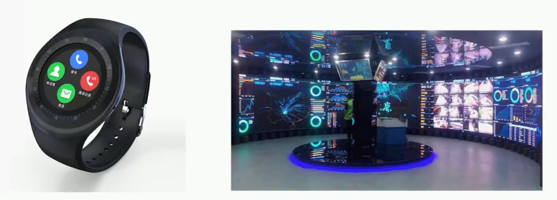

而传统的单一布局方式已经无法满足如此丰富的产品需求，需要更多的手段来加以实现。新框架的诞生也脱离不开 CSS 布局。

从未来的前端的发展趋势来看，界面相关的技术依然会以 CSS 为主。前段时间，华为推出来了鸿蒙操作系统

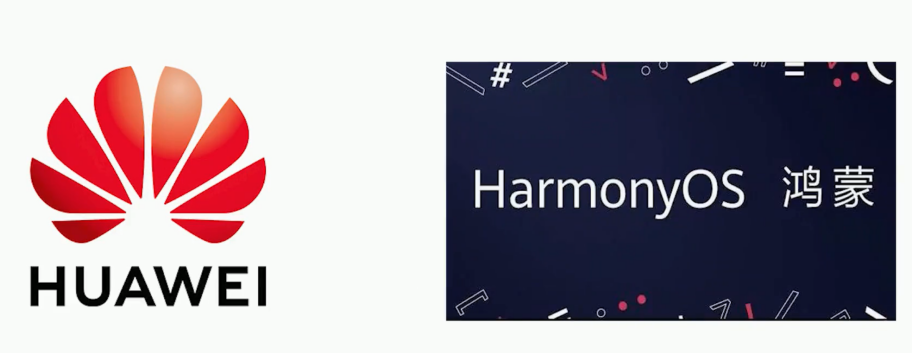

它可以采用前端技术进行开发，而样式布局依然是 CSS 来实现的。所以**学习 CSS 布局也是适应未来发展的**。

### <mark>2）课程有哪些收获？</mark>
 
💡：首先，将收获**精通现代布局四大核心技术**。

本课程将摒弃传统的老旧的布局模式，主要会围绕着现代布局中的四大核心技术进行精讲，学习内容更符合现在及未来的使用趋势，分别是 flex 弹性布局、grid 网格布局、移动端适配布局以及响应式布局。

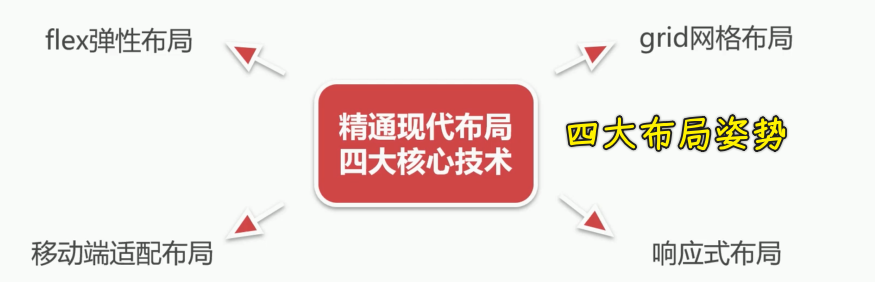

学习完这四块布局之后，基本可以满足 **90%** 常见的布局需求。
 
💡：其次，我们将收获**与设计师配合**

本课程将以人为本，更多的站在开发者的角度去分析问题和解决问题，与 UI 设计师如何配合，如何高质量的还原 UI 设计图等操作等，都是成为一名优秀的前端开发工程师所必备的技能。所以我们将学习到设计图相关的一些概念， PhotoShop 切图详解，标注工具像蓝湖、PxCook 的使用以及智能平台 imgCook 等

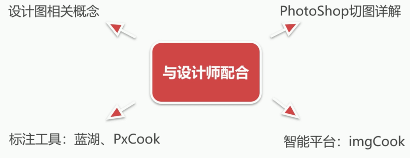

💡：课程还将收获很多**实战经验**
 
课程学习**非纸上谈兵，而是学以致用**。本课程将安排有大量实战案例进行讲解来巩固所学知识点，包括 **20+** 以上的常见布局方案、 **7** 个综合案例、**1** 个综合项目以及特殊布局案例等内容。案例不是以单纯的实现为目的，而是更多的分享技巧、经验以及更好的实现方式。

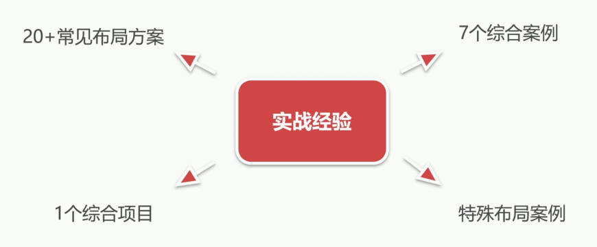

### <mark>3）课程章节的具体安排</mark>

#### <mark>1、章节内容安排</mark>

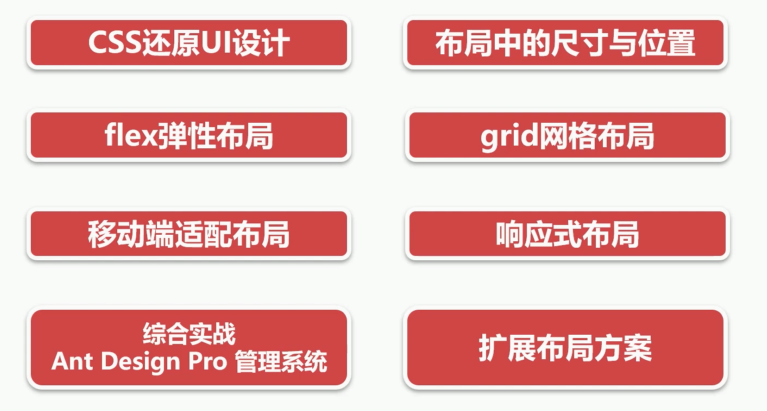

首先在前两章当中，我们主要是了解一些关于布局当中的一些基本的操作，像 CSS 还原 UI 设计布局中的尺寸与位置

接下来的章节当中，我们将去详细的讲解我们前面介绍的四大布局方式，分别是 flex 弹性布局、grid 网格布局、移动端适配布局以及响应式布局。四大布局当中我们不仅是只讲这个理论基础，还会配合相关的案例以及我们的一些综合案例。
 
这四章讲完之后，就进入了我们在综合实战的一个案例讲解当中，是 Ant Design Pro 的管理系统，老师会带着大家从 0 到完整的方式来实现我们首页的一个开发，并且掌握更多的一些开发的技巧。

最后我们还会安排一些扩展布局的方案，来让大家去学习一些特殊布局是如何来实现的。

#### <mark>2、核心知识点</mark>
 
那我们再来看一下我们的一个核心知识点，大概有 **50+** 以上，比如说像弹性、网格、浮动、定位这些：

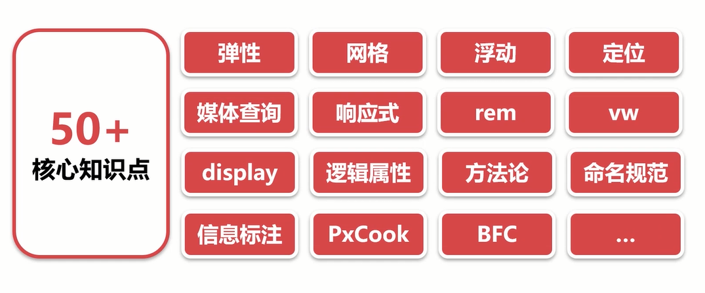

#### <mark>3、布局方案</mark>

我们会在课程当中都会给大家进行详细的讲解。除了核心知识点以外，咱们还有 **20+** 布局方案，而这些方案其实可以满足我们大部分的开发需求，像不定项居中、均分列、视觉差、等高等等这样的一些布局方式。

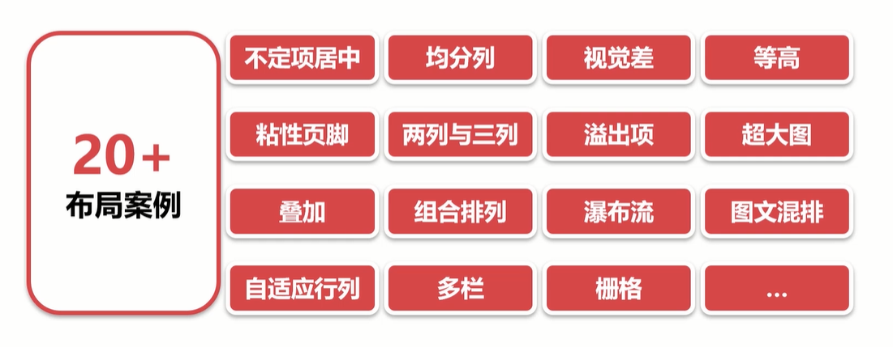

#### <mark>4、图文教程</mark>

除了这些以外，我们还有 **12+** 的图文教程，让我们的课程更加的丰富，例如 CSS 的发展史与 CSS 模块划分、移动端概念及 UI 设计图、书写模式与逻辑属性以及 CSS 方法论及样式规范等等。

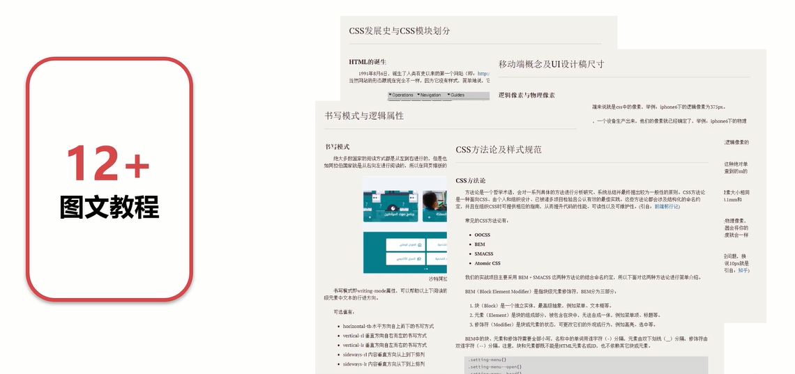

#### <mark>5、测试题与练习题</mark>
 
除了这些以外我们还安排了大量的测试题与练习题，能够让大家学完知识点之后来对知识点进行巩固。除了有一些理论性的测试题以外，我们更多的是这种偏实战的练习题，这些偏实战的练习题都会配有相应的参考答案，可以让大家更好的去把我们的内容进行吸收。

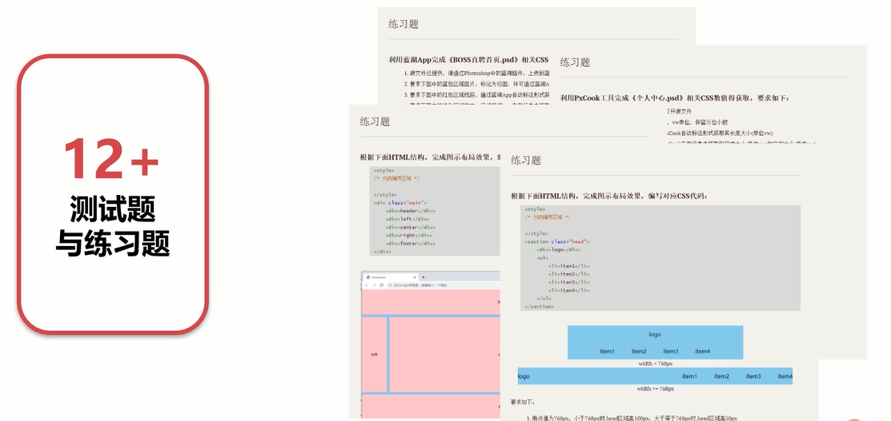

#### <mark>6、综合案例（7 个）</mark>

课程还安排了 **7** 个综合案例，像 swiper 轮播图、知乎导航等等。

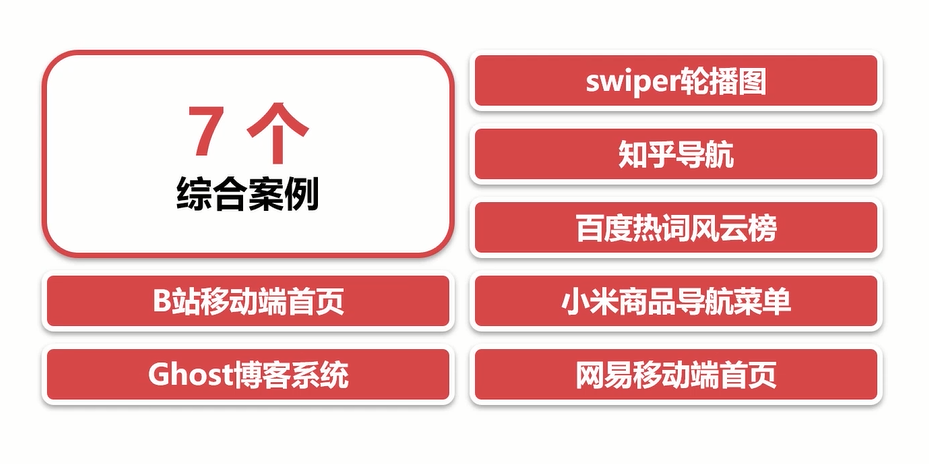

#### <mark>7、实战项目：Ant Design Pro 管理系统</mark>
 
除了这些综合案例以外，还有就是我们前面介绍的一个实战项目 Ant Design Pro 管理系统。这里我们会带着大家搭建我们的一个框架，以及像**文件的划分**，包括像**命名**等等这样的一些方法论的操作，还有我们的具体的一个应用的开发。当然，一个复杂的页面，它除了有布局以外，更多的是要怎么样跟我们的交互进行配合，如何来编写更加值得我们去推荐的一种**选择器**的方式，来更好的配合我们后续的一些交互的实现。这些都在本章当中给大家进行一个详细的讲解。

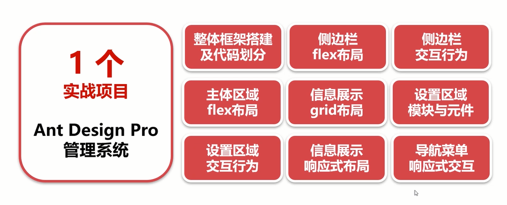

### <mark>4）案例介绍</mark>

下面我们稍微给大家看一下我们做好的案例，这里点开我们的浏览器可以看一下。
 
像这种就是移动端非常常见的一种轮播图的方式。

然后像我们这种知乎导航

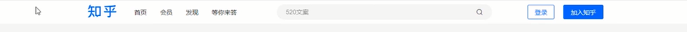

我们还有比较复杂的这种不规则的布局

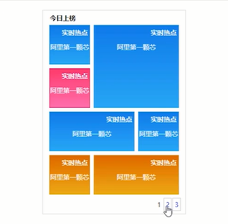

还有我们这种列自适应的布局方式，这个列是可以自适应的到底是如何做到的？

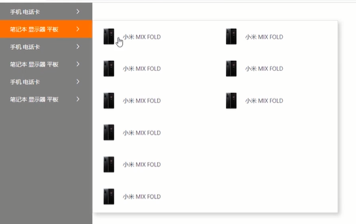

包括我们移动端网易的首页搭建

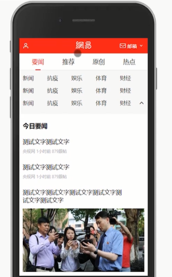

还有我们移动端 B 站的一个首页的搭建

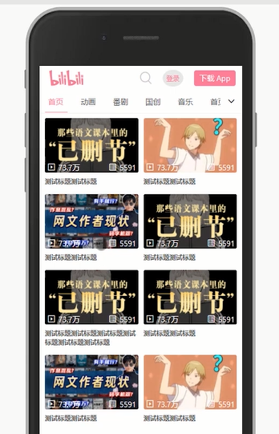

然后我们的响应式布局当中要给大家讲一下 ghost 博客的一个实现，这是具备响应式的，可以让它在不同的分辨率下非常好的能够展现出来

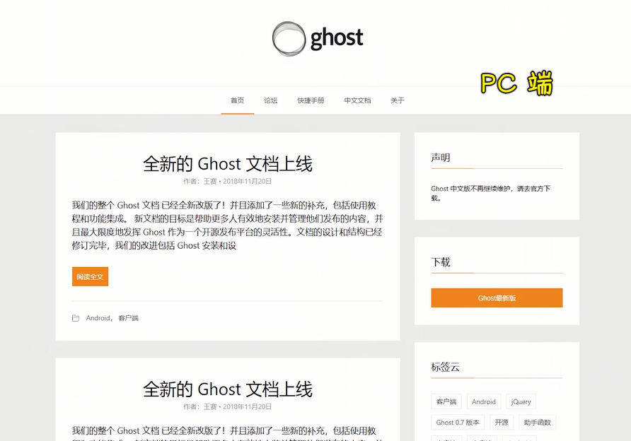

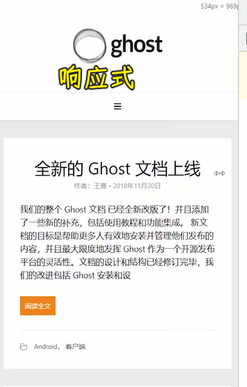

这是它在移动端的一个表现形态

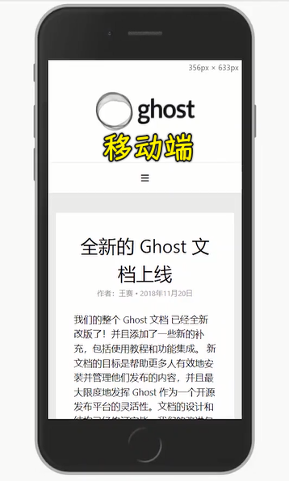
 
好了，除了这些以外，我们最后的一个综合案例就是我们的管理系统

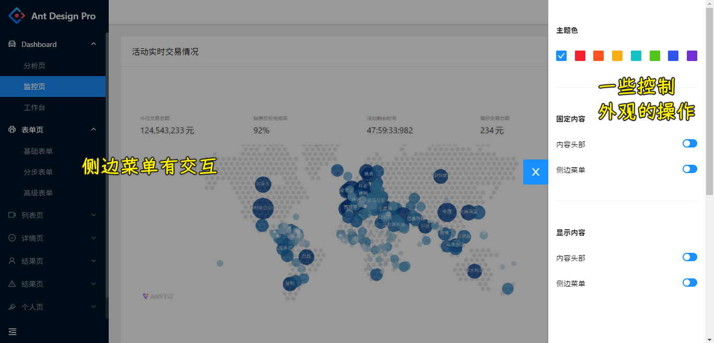

管理系统的侧边栏也会加上一些简单的交互，然后我们这边可以选择不同的一些交互行为，包括它默认的是固定的这个菜单，我们现在是可以给它进行非固定的一个选择。当非固定的时候它会跟着我们页面发生变化，包括这边一个可以折叠的菜单，我们可以随意切换回来。

还有对于这个侧边栏和上边顶部导航进行一个显示隐藏（点击图标的隐藏与显示）。

我们再来看一下它的响应式，当我们分辨率变小的时候，它也可以做一些响应式的变化。

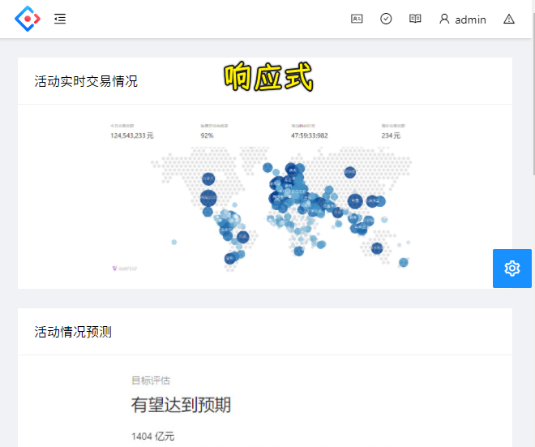

比如说这是我们切换到移动端的一个样子。大家可以看到在移动端的时候，我们也可以点击菜单的时候，对它进行一个显示隐藏以及我们这边可以换各种不同的主题色，前面也演示过了。这些都是同步的把它们完成的（只写一份代码），这些就是我们具体的一个实战开发的一些代码。

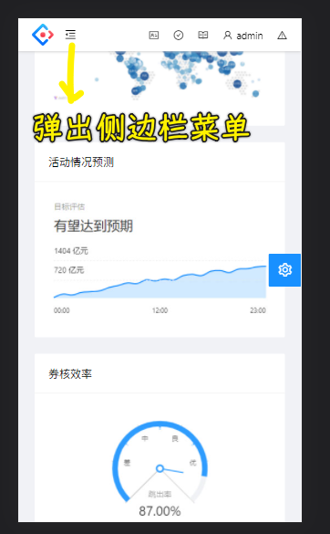

### <mark>5）本门课比较适合哪些同学来进行学习？</mark>

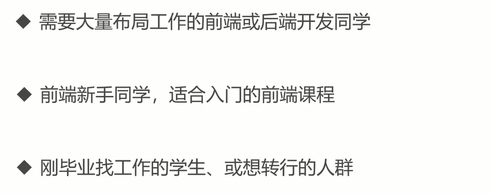

- 首先需要大量布局工作的前端或后端开发同学
- 前端新手同学也是非常适合作为我们的一个入门课程进行学习的。因为咱们前端的入门同学最好是先学习 HTML+CSS，有了这些基础之后再学习 JS 或者是一些前端框架会比较好一些
- 最后这门课也比较适合一些刚毕业找工作的学生或想转行的人群，这也是非常好的一个入门咱们前端的这样的一门课程。

好了，咱们这门课程就给大家做了一个简单介绍。最后跟着老师的脚步一起来学习这门课程吧！

## ★常见布局展示及技术分析
