### ✍️ Tangxt ⏳ 2021-09-26 🏷️ CSS

# 05-Photoshop 还原 UI 设计、蓝湖 App 快速标注信息、PxCook 自动标注工具、 imgcook 设计稿智能平台

## ★Photoshop 还原 UI 设计

在前一个图文的小解当中，我们讲了设计师会给我们提供的是相关的图片源文件。常见的源文件类型有什么呢？有我们的这个 `sketch` 文件或者是我们的 `psd` 文件以及我们的 `xd` 文件。

我们这一小节就给大家演示其中一种操作，就是利用这个 Photoshop 还原我们的 `psd` 文件，来完成我们 CSS 相关代码的测量。

首先需要去安装一下我们的这个 Photoshop，这里我安装的是 Photoshop CC 2019。我这里建议大家，咱们最好都安 CC 以上的版本。当然了我不限定是 2020 还是 2021，那我们可以自行的去安装一下，包括我之前给大家提供了相关的 PS 工具网盘地址，大家也可以去安装。

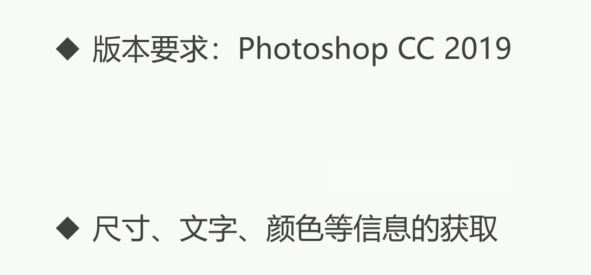

接下来，就来看一下我们是如何进行尺寸、文字、颜色等信息的获取。

首先我给大家准备了一个相关的 psd 文件，大家可以看到这个 psd 文件：

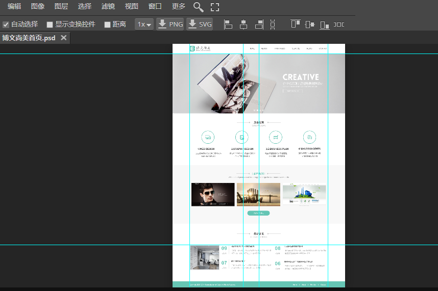

1）尺寸大小测量

用 PS 打开该文件，基本上我们要测量的就是**尺寸的大小**，我们先来看一下尺寸大小的测量。

尺寸大小的测量我们需要用到我们的第二个矩形选框工具，并且配合一个信息面板。这个信息面板是在我们窗口当中，我们可以把这边勾选上有个信息：

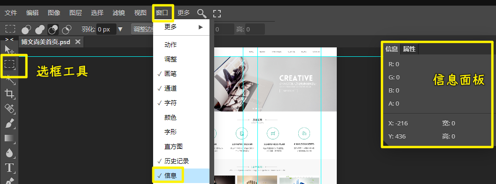

在这边选择一下它的一个面板选项，这里的单位给它调成像素，调好之后我们可以看到，现在我就可以测量这**两个圆之间的间距**了。通过第二个工具矩形选框工具就可以去测量出来，我们可以做一些微调，大家可以看到这边，就可以量出它的宽是 `164`，高度是 `92`。

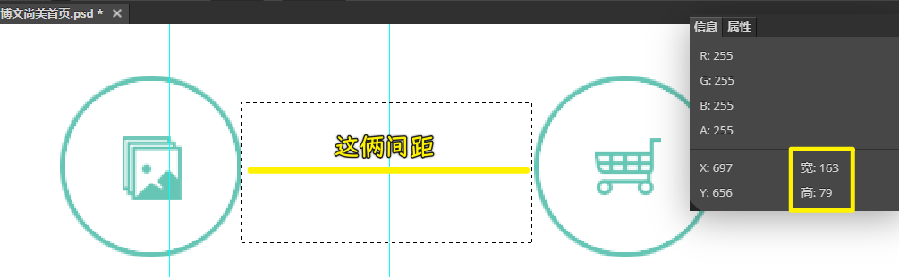

话说，怎么能够对这个选框进行一个变大或者是缩小呢？

我们可以按住 Shift 键，可以看到矩形选框后面会多出一个加号，可以再去给它扩大选中范围。如果说按住 Alt 键，我们可以看到鼠标后面会多一个减号，我们可以对它进行减少，总之，我们是可以通过这样的方式来进行测量的。不过这种方式是比较慢的。

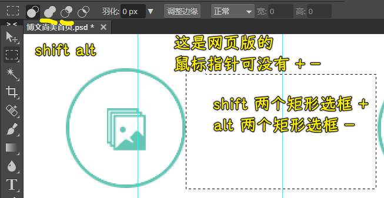

所以说我们还可以利用第一个工具，也就是选择我们的这个移动工具，按住我们的 Ctrl 键我们可以看到，这时候你就可以看到它们之间的一些数值啦。比如说我们先选中第一个图层，在这边有图层，我们可以先选中第一个图层。选中第一个图层之后我们再选一下可以看到你看这时候鼠标移到第二个图层上面就可以显示它们之间的间距为 163 像素。这个时候是可以随便的去测量一些相关的数值的。

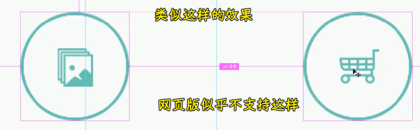

**只要按住 Ctrl 键，再选择第一个工具**。

2）颜色信息获取

除了尺寸测量以外，我们还可以去测量相关的颜色。颜色的话我们是可以通过吸管工具。这里我们可以找到吸管工具，把图片稍微放大一些。这个时候我们就可以在这里来吸取我们的颜色了。大家可以看到点开这个试色器就可以拿到相关的颜色。

我们可以看到这边有我们的 HEX 以及 RGB 以及我们的 HSB 相关的颜色的数值可以获取到，这是颜色的获取：

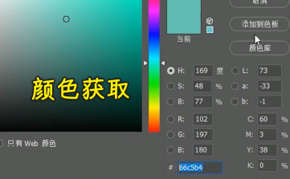

3）文字信息获取

文字相关的获取我们也可以得到。比如说选择第一个我们的这个移动工具，然后选择可以看到这边可以选择相关的文字图层，点开字符，这里就可以看到相关的字体的相关信息。比如说有 `18` 个像素的文字大小，以及相关的像**行高**以及**是否加粗**以及**字体大小**等等这些都可以查看得到。所以说我们这个选择文字，再去查看它的字符，就可以看到相关的信息了。

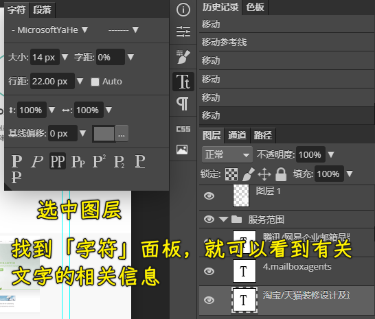

4）切图操作

除了这些以外，我们再来看一下 PS 当中经常可以做的就是进行切图操作。就是说把我们设计稿当中的图片给它切取下来，基本操作是这样的：

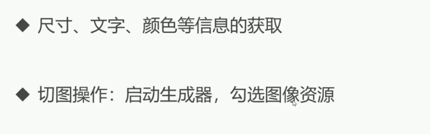

首先我们要启动这个生成器，勾选图像资源。那我们打开我们的 Photoshop 然后来选择编辑当中的首选项。然后在首选项目当中，我们选择这个增效工具。打开增效工具之后可以先把这个启动生成器先给它勾上，其他的我们就不用动了，勾好之后我们点开文件。在文件当中我们可以看到这边有个「生成」，我们把它的这个「图像资源」给它勾上，如果勾上成功的话，那「图像资源」会前面就会有个`✔️`对号，这样一来我们就可以选中这个图形。

在`psd`文件里边，随便选一个图形，我们紧接着就双击一下这个名字，把这个做一个重新命名。这里我们可以起个名字，比如叫 `icon1`。这个`icon1`我们要加上这个图片的一个格式，可以选择 `jpg` 或者是`png` ，这里面选择`png`常见的图片格式，点击回车。

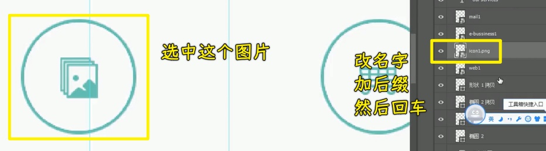

点击之后我们可以看一下我们本地的文件夹（与该`psd`文件同级），在我们的文件夹下就自动生成了一个文件夹，这个文件夹会跟我们的 psd 文件在同一个目录下，然后它的命名会有一个`assets`这样一个标识。点进去之后大家可以看到里面我们刚才重命名之后的这个图片就给它切下来了，或者是获取到这个相关的图片资源。

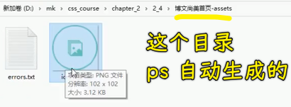

接下来再给大家重新演示一个，比如说像我们这个购物车，我们点中它之后，同样我们去重新命名，比如说`icon2.png`，保存，然后可以看到这时候这个图片就给它取下来了。

在这个操作过程当中它还可以进行倍图的获取。比如说我们双击之后，在我们的前面加上一个`200%`，再来一个空格：

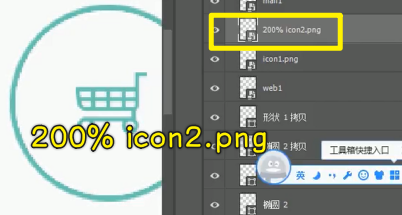

当我们回车之后，我们可以看到这张图就会变成一个倍数的图。我们双击打开可以看到这张图其实就变大了，比刚才这张第一张图要大了一倍。所以说我们这个大小也是可以进行简单调节的，这就是我们利用 Photoshop 来做一些相关信息的获取，这样的话我们就可以根据这些信息来进行我们的 CSS 相关的内容的这个样式的编写。

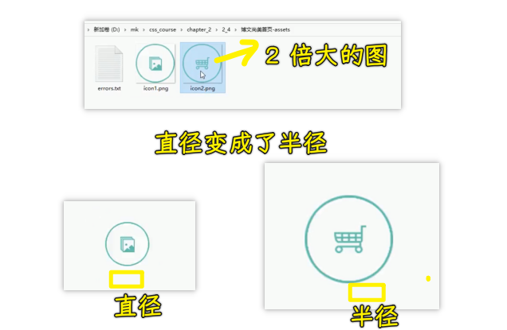

> 我们用 PS 这个工具干嘛？ -> 要对这个 `psd` 文件获取一些信息，以此来完成对 CSS 的编写 ！

## ★蓝湖 App 快速标注信息

在本小节当中，我们将学习蓝湖 App 快速标注信息。首先我们对这个软件做一个简单的了解。

1）是什么？

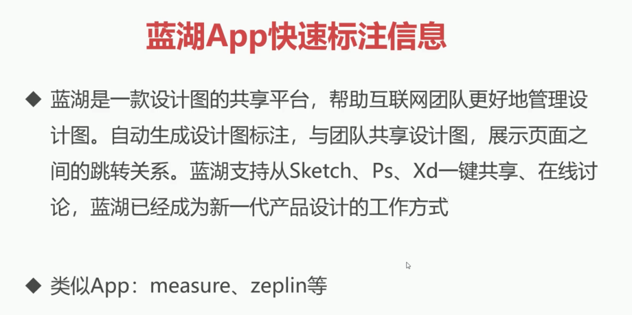

蓝湖是一款设计图的共享平台，帮助互联网团队更好地管理设计图，自动生成设计图标注与团队共享设计图，展示页面之间的跳转关系。蓝湖支持从 Sketch、Ps、Xd 一键共享、在线讨论，蓝湖已经成为新一代的产品设计的工作方式。当然跟蓝湖类似的 App 也比较多，大家可以自行的去进行了解。这里我们就以蓝湖来给大家进行举例。

2）使用它的好处

首先我们来说一下这一类的 App 到底比我们的 PS 进行 UI 还原，到底有什么样的一个好处。这些平台它最大特点就是**团队共享**。也就是说我们的设计师在开发好 UI 设计图之后，直接就可以上传到平台上。我们的开发人员就可以立即得到相关的资源，这个是非常方便的。而最重要的一点是这个平台它是可以支持各种源文件的。比如说我们的 `psd`，我们的 `sketch` 以及我们的 `xd` 文件，这就会带来什么好处呢？

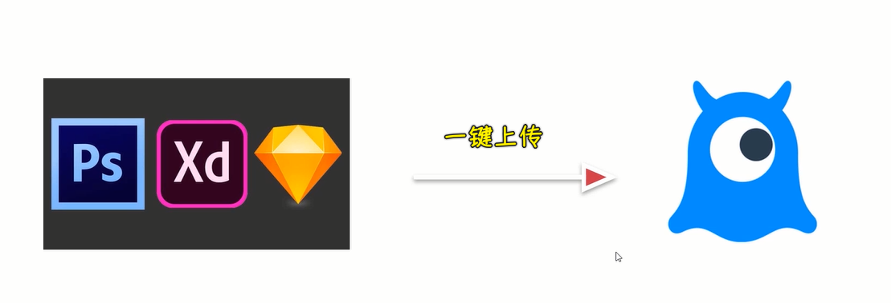

如果说传统的我们用 Photoshop 去进行切图的话，我们只能处理 PSD 文件，要是其他源文件格式，我们还得去学习专门的这个相关的软件，所以说学习成本是会高一些的。如果说这些源文件都可以直接上传到我们的蓝湖上，我们就可以**只在蓝湖上学会一种操作模式，就可以轻松的应对各种不同类型的源文件了**。所以说这是非常好的一种方式。接下来我们就来了解一下这个蓝湖 App 究竟该如何去进行使用。

3）如何使用它？

1、注册账号

首先我们去它的 [在线访问地址](https://lanhuapp.com/)，打开之后，咱们可以自行的去注册我们的账号，注册完账号登录进来之后，我们该怎么来使用呢？

2、下载相应插件

非常简单。首先我们去点开官网，在官网当中，大家可以先看一下它这边有下载。这个下载里面主要是**首先要下载你的设计稿源文件所对应的插件**。比如说我们是 Sketch 的一个源文件，那你就要下载 Sketch 插件。如果说我们是 PSD 的这个源文件，我们就下载 Photoshop 的插件。当然这里面还有 XD 的，其是也就是我们常用的几种插件。

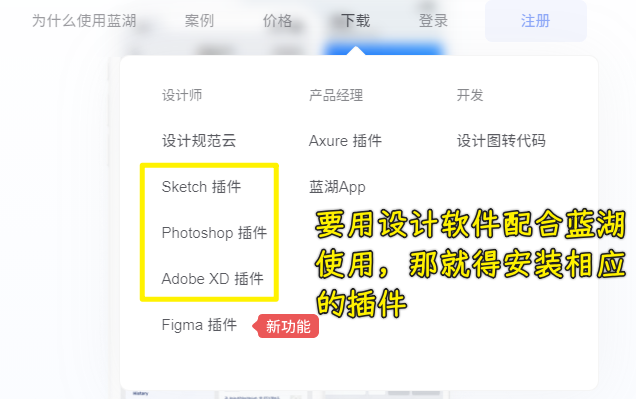

那这里我们可以先去下载我们的 PS 插件，那我们就点击下载就行了。下载好后，大家可以自行的进行下一步下一步的安装。安装好我们打开 Photoshop 就可以在我们的这个窗口当中看到一个叫做「功能扩展」，在窗口的功能扩展当中，可以看到这里面就有插件，它就会自动集成到我们这个扩展功能当中。

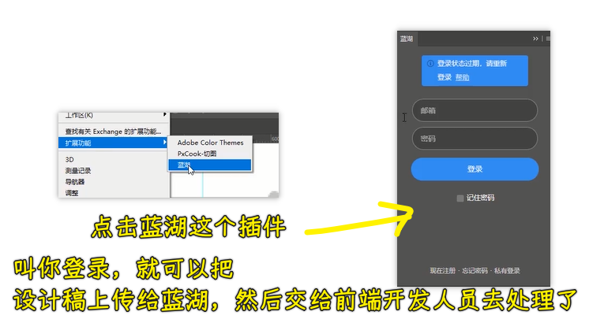

3、在设计工具中登录你的蓝湖账号

接下来我们去点一下蓝湖，我们就可以登录一下我们的账号，并且把我们这个相关的设计稿上传到登录的这个蓝湖 App 账号中，接下来我给大家进行演示。

4、在网页版蓝湖应用里边创建一个项目

首先我在这边新建一个项目，新建之后我们起个名字，这个咱们就选择「博文尚美」。然后我们选择到底是网页项目还是手机项目，我们选择网页项目，然后点击确定。

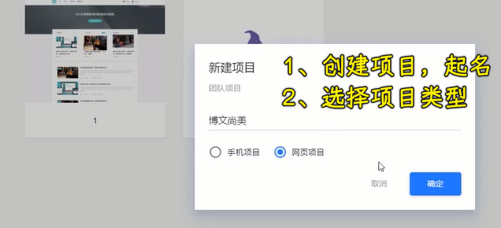

5、设计师在设计工具中上传设计稿

这边准备好之后，再打开我们的 Photoshop， 这样的话设计师就可以非常轻松的去进行相关的上传了，登录一下我们的账号。

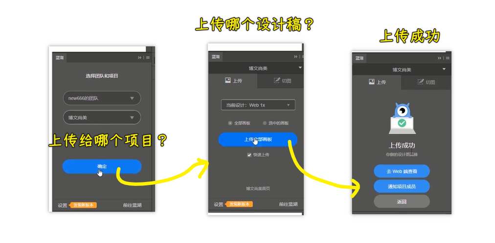

我们登录进来之后，大家可以看到就可以发现刚才我们创建好的这个博文尚美的项目了，接下来我们就可以往这个上面进行上传，我们可以等待一下，这个有点慢，我们现在点确定就可以了。确定之后我们现在就可以选择这个上传就可以了。我们上传成功后就可以去外部端进行查看。

6、前端开发者在网页版蓝湖应用里边得到了设计稿

当然，我们刷新一些刚刚创建项目的页面就好了，之后我们可以看到这张设计图就进来了，我们只要双击就可以看到，**在这个平台上我们就可以对它进行一些尺寸的测量以及相关的信息的获取**。比如说我们现在点一下这个图，大家可以看到这边就会显示它的大小，以及我们直接就可以在这看到它与其他元素之间的间距、位置等等这样的一些信息。并且它这个平台比较好的就是会把相关的代码也给你显现出来，可以作为我们的参考。

7、测量尺寸

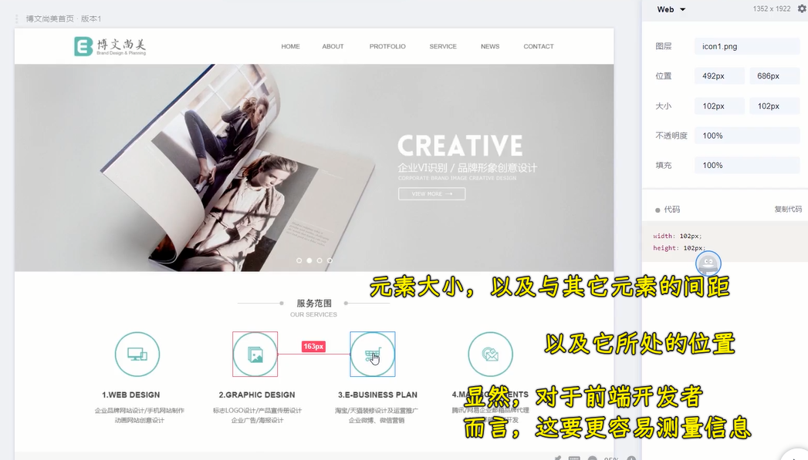

8、获取文字信息

那我们来看一下文字相关的信息，这边也会有相关的文字，比如说我们的**字号以及我们的行高、字间距、对齐方式是否加粗以及字体大小**，这些也是非常容易轻松地获取到，我们可以看到非常的方便。

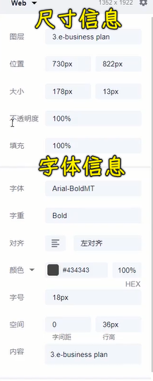

9、前端开发者用蓝湖来获取信息有啥好处？

并且这个平台还有一些比较好的点，跟我们的 Photoshop 去比的话，比如这边还可以选择我们的一个平台，它还可以去适配我们的 iOS、安卓，可以做一些自定义的，比如说在移动端，我们后面也会给大家讲，我们的测量的尺寸并不是 `px` 单位，而是我们的 `rem` 单位或者是 `vw` 单位。所以说这边它也可以选择换算成我们乘一个相关的 rem 单位。

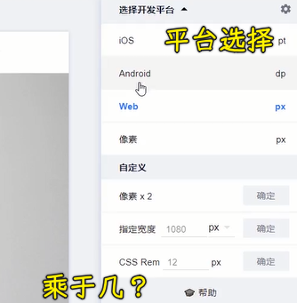

比如说我现在选择这个地方，然后点击确定。接下来大家可以看到我现在测量出来的尺寸，就立即得到相关的 `rem` 单位。

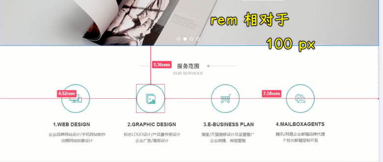

这样的话，用这个软件去适配我们的移动端的页面是非常方便的，具体的 rem 怎么去用，包括移动端怎么开发，会在我们后面儿的章节当中给大家进行详细的讲解，只不过我们这个平台是非常方便的。

10、如何用蓝湖切图？需要设计师配合

接下来给大家演示一下如何能够把相关的图片给它获取到在这个平台上。要想获取到相关资源，首先我们设计师需要在我们的 Photoshop 或者是一些软件儿当中进行相关的处理。比如说点一下这个图，想把它做成图片的话，我们就要点一下切图，然后把它作为一个叫做标记。

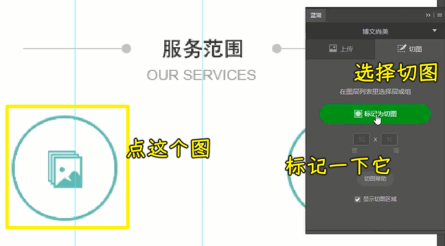

做完标记之后，我们再去点另外一个图片，再给它点一下，这样的话也把它做成标记。

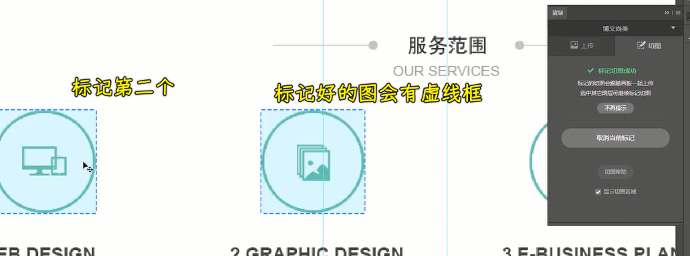

标记好后我们就可以再重新的去上传一下。等待它的一个同步完成之后，我们再回到我们的项目当中。

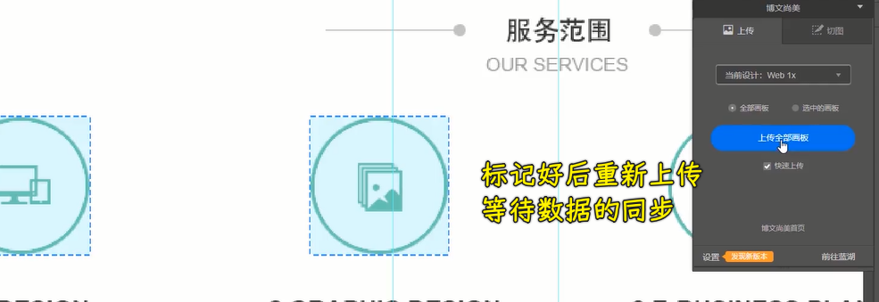

现在刷新一下，重新刷新之后，大家可以看到这边就多了一个历史版本，刚才上传的是第一个历史版本。下面是我们刚才上传的第二个历史版本。在第二个历史版本当中，我们可以看到这边就有两个虚线框，其实就是我们把它已经做成了图片资源：

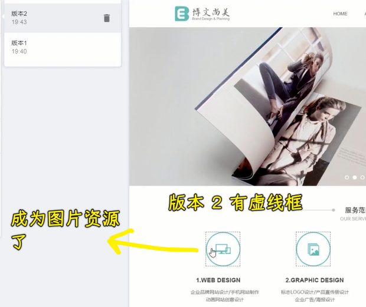

我们点击图片资源，右侧就可以看到有下载当前切图，就可以把这张图下载下来了。

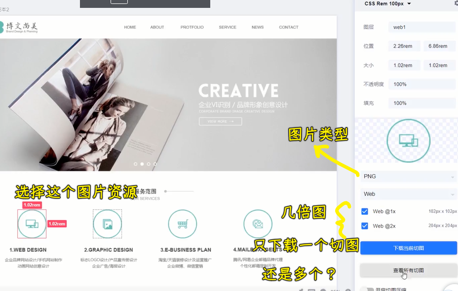

并且我们可以看到它还可以选择下载所有的切图，也就说一键下载所有的你标注好的这些切图，所以这是非常方便的。并且还可以选择不同的类型以及我们是一倍图还是二倍图。因为在移动端的时候这个其实是有「**倍图**」这样一个概念的，也是到我们去讲这个移动端的时候，再给大家详细的去分析。所以说我们先来看到这些在线的这个平台还是非常方便的，可以帮助我们快速的解决一些切图的难题，尤其是它最大特点就是统一了不同的我们的这个源文件的一个使用方式。那希望同学们可以自行的去练习一下。

## ★PxCook 自动标注工具