### ✍️ Tangxt ⏳ 2021-12-01 🏷️ 响应式布局

# 响应式布局

1）概述

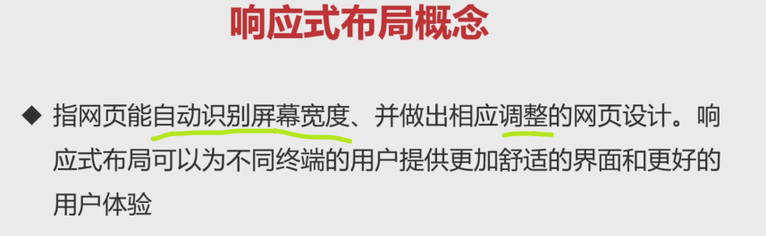

- 大型网站：准备两个站点 -> 两套代码
- 中小型网站：使用响应式布局 -> 一套代码

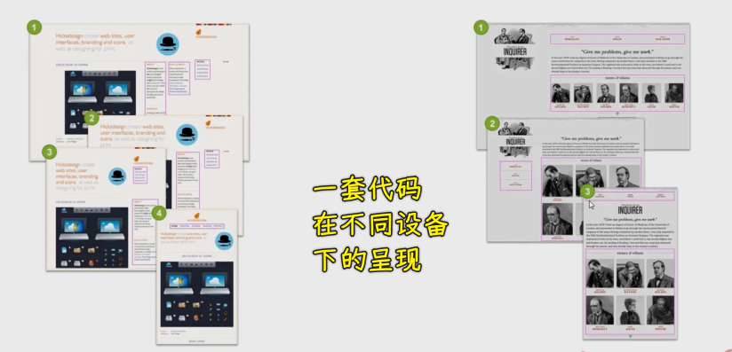

课程安排：

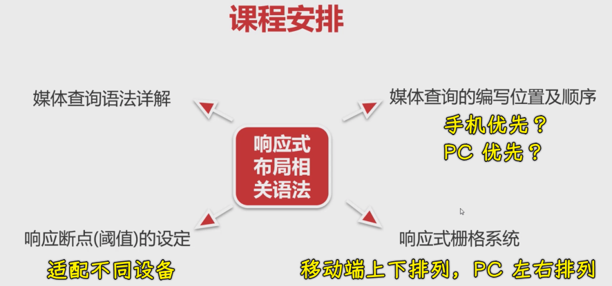

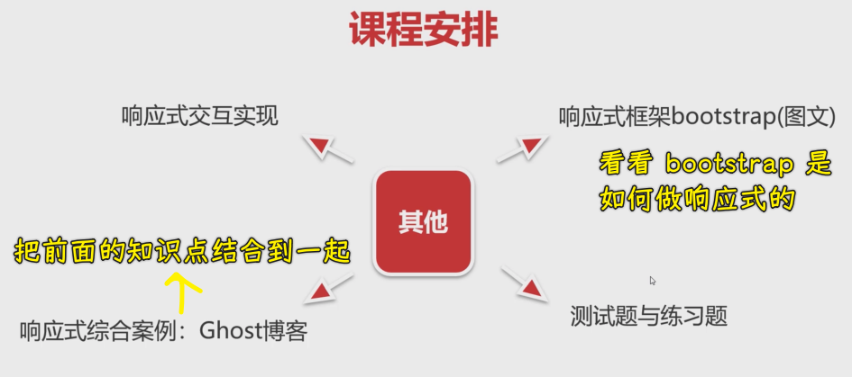

2）媒体查询语法详解

搞响应式布局，主要就是用媒体查询来实现

1、媒体类型

媒体类型：满足某种设备类型才会触发相应样式生效

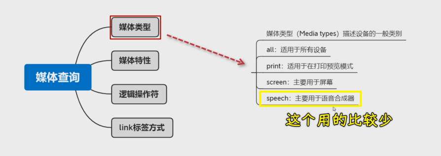

2、媒体特性

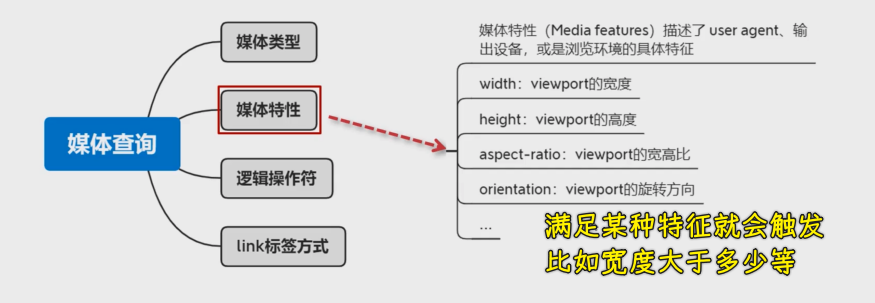

高度一般很少做响应式，一般都是搞宽度

3、逻辑操作符

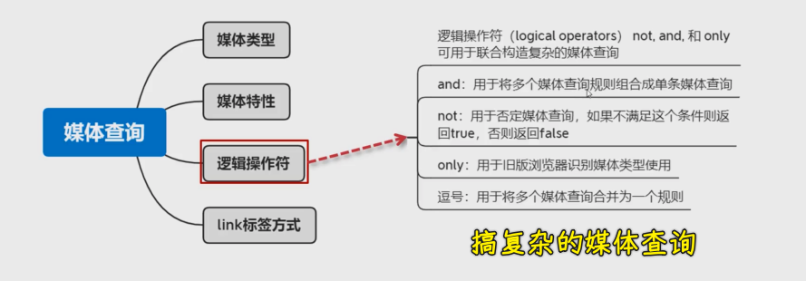

- `and` -> 区间
- `not` -> 取反
- `only` -> 高级浏览器不需要加，旧版浏览器需要加 -> 没有太大的价值
- `逗号` -> 相当于是或操作，你写了多个条件，只要满足其中一个就会触发相应的样式

4、link 标签方式

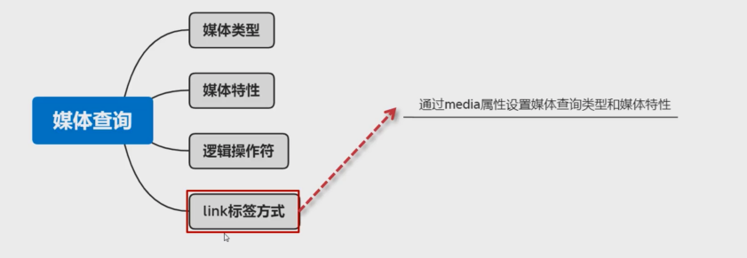

5、代码

``` css
/* 媒体类型：print */
@media print {
  .box {
    font-size: 60px;
  }
}

/* 媒体特性 */
/* max-width: 1200px */
/* 屏幕大于等于 700px 时，样式就会生效，小于 700px 就不会生效 */
/* 你身上至少有 700 块 */
@media (min-width: 700px) {
  .box {
    width: 200px;
    height: 200px;
    background: pink;
  }
}

@media (orientation: portrait) {
  .box {
    width: 200px;
    height: 200px;
    background: pink;
  }
}

@media (orientation: landscape) {
  .box {
    width: 200px;
    height: 200px;
    background: skyblue;
  }
}

/* 逻辑操作符 */

/* 同时成立 */
@media screen and (min-width: 700px) and (max-width: 1200px) {
  .box {
    width: 200px;
    height: 200px;
    background: pink;
  }
}

/* 在 700 px 之下 */
@media not screen and (min-width: 700px) {
  .box {
    width: 200px;
    height: 200px;
    background: pink;
  }
}

/* 或操作，满足一个条件即可 */
@media screen,
print and (min-width: 700px) {
  .box {
    width: 200px;
    height: 200px;
    background: pink;
  }
}
```

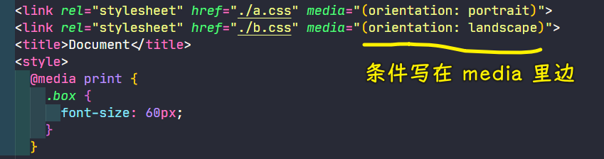

3）媒体查询的编写位置及顺序

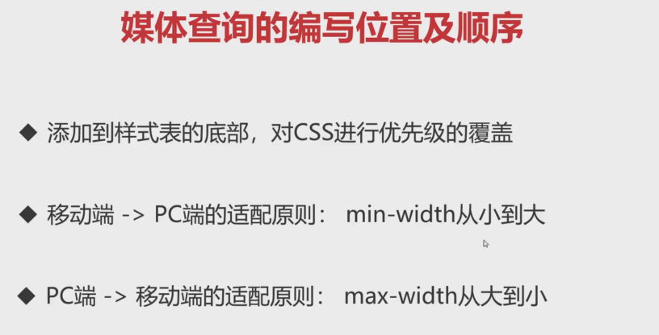

第一点：

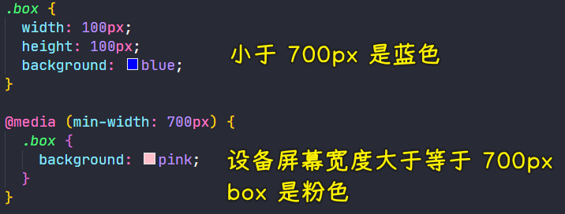

第二点：

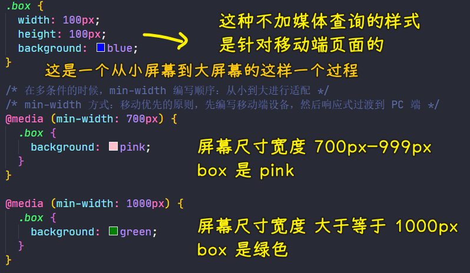

第三点：

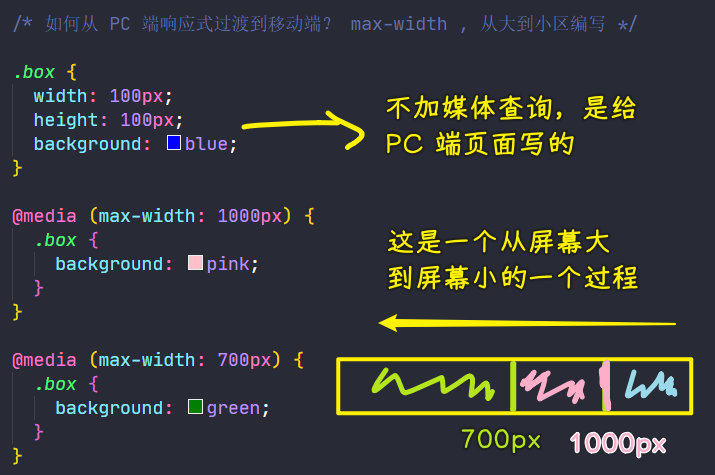

> 蓝色盒子：`(1000px, 正无穷大）` -> 粉色盒子：`(700px,1000px]` -> 绿色盒子：`[0px,700px]`

关于响应式布局，推荐移动端优先，也就是用`min-width`，当然，这不是绝对的，这一章后续的案例会用移动端优先，下一章的大案例会用 PC 端优先

4）响应断点（阈值）的设定

响应断点设定，也叫阈值设定，说白了，就是设备的临界点 -> 它决定了`min-width`该取多少？`max-width`该取多少？

有很多种设备：

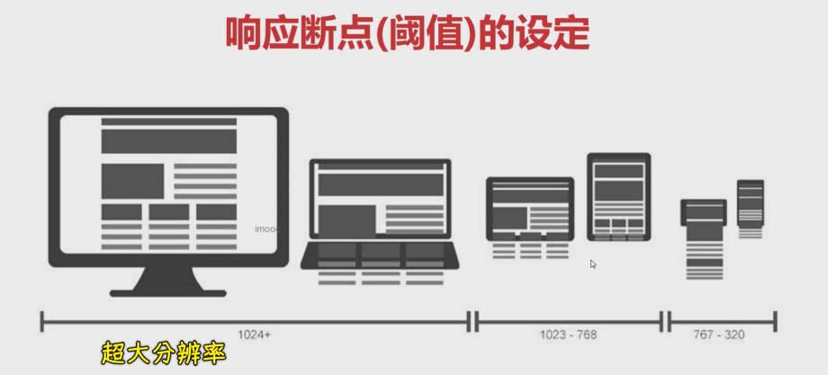

对于这些分辨率，我们一般会选择几个点作为断点 -> 选择啥值作为断点呢？没有标准答案，这里推荐以下这种（大家比较认可的设定）：

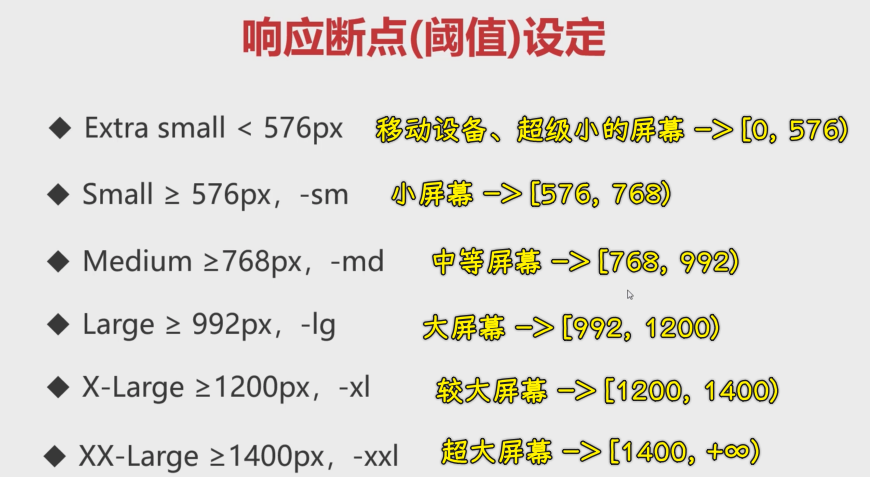

例子：

``` html
<div class="d-none">11111</div>
<div class="d-sm-none">22222</div>
<div class="d-md-none">33333</div>
<div class="d-lg-none">44444</div>
<div class="d-xl-none">55555</div>
<div class="d-xxl-none">66666</div>
```

``` css
.d-none {
  display: none;
}

@media (min-width: 576px) {
  .d-sm-none {
    display: none;
  }
}

@media (min-width: 768px) {
  .d-md-none {
    display: none;
  }
}

@media (min-width: 992px) {
  .d-lg-none {
    display: none;
  }
}

@media (min-width: 1200px) {
  .d-xl-none {
    display: none;
  }
}

@media (min-width: 1400px) {
  .d-xxl-none {
    display: none;
  }
}
```

> 通过加类似`lg、xxl`等这样前缀的方式，来让某个样式在某种屏幕尺寸下生效 -> 比如一些用于布局的样式

效果：

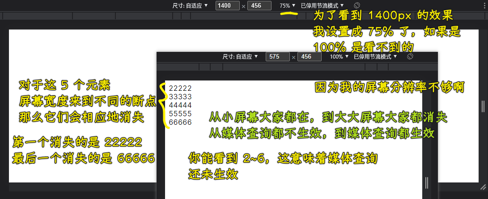

5）响应式栅格系统

``` js
响应式栅格系统 = 栅格系统 + 响应式
```


