### ✍️ Tangxt ⏳ 2021-09-28 🏷️ CSS

# 08-CSS 盒模型的组成、块级盒子与内联盒子、自适应盒模型的特性、标准盒模型与怪异盒模

## ★CSS 盒模型的组成

我们一起来看一下 CSS 盒模型的组成。

1）什么是 CSS 盒模型？

首先了解一下什么是 CSS 盒模型。

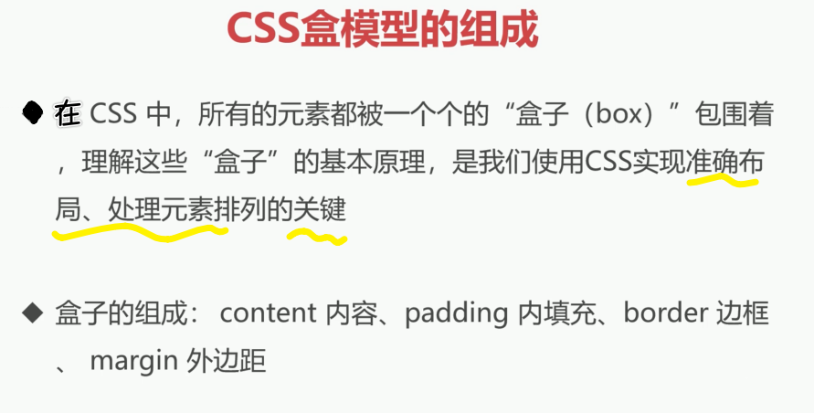

在 CSS 中所有的元素都被一个个的盒子，也就是我们的一个 box 包围着，理解这些盒子的基本原理，**是我们使用 CSS 实现精准布局处理元素排列的一个关键所在**。

2）盒子模型的组成

我们一起来看一下盒子模型的组成。

盒子模型简单是由我们四部分组成的，第一部分就是我们的 `content` 内容部分，第二部分是`padding`，也就是内填充，第三部分就是我们的`border`边框，第四部分就是我们的 `margin` 外边距。

话说，这四部分在盒子当中的一个关系是怎样的呢？

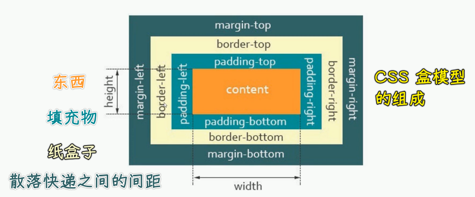

可以看到它们其实是这种嵌套在一起的，最内层的其实就是我们的`content`内容区域，然后是我们的`padding`区域，`padding`之后则是咱们的`border`边框，边框的外面就是我们的外边距`margin`。

为了更好地理解它，我们举一个简单的例子：

我们可以把这个盒模型理解成一个快递的话，那`content`就是我们真正的里面快递的物品。而这个`padding`我们可以理解成是物品与盒子之间的这个填充物，那`border`就是盒子。而这个`margin`就是我们多个快递之间的间距，你可以这么去理解，比如说我们有多个盒子的话，通过`margin`可以让它们之间产生一个距离，可以把它们间隔开。

具体我们通过代码给大家简单的来演示一下。

1. 打开编辑器
2. 创建一个`1demo.html`
3. 在页面当中写我们的第一个盒子：`
我是一个盒子
`
4. 给它一点样式
5. 在浏览器打开它，可以看到它就是一个元素、一个盒子

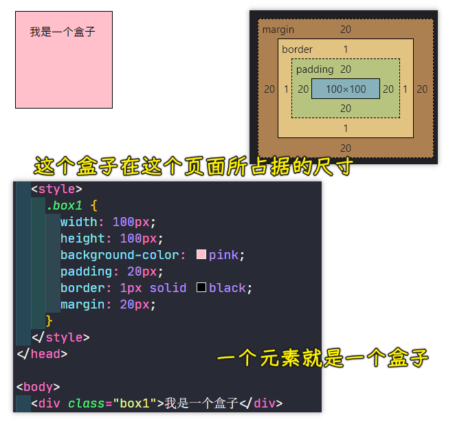

这就是我们盒模型的所有组成的部分。好了，大家可以看到，我们对`padding`和`margin`设置了四个方向的值，因为我们只给了一个值，如果给两个值就是`上下`和`左右`，三个值不常用因为不方便，四个值就是一个顺时针的`上右下左`，我们还可以单独只设一边是填充的，一边的是边距的，这一点看盒模型那个图就行了，如`padding-left`和`margin-right`

我们了解了这个盒模型的基本组成之后，可以发现它们就形成了一个盒子所占据页面的一个大小，这个就是我们**最基本的布局当中的元素尺寸**。

**了解盒模型基本上你就知道了这个容器它所占据的尺寸大小是多大，方便我们做排版**。

3）对于 CSS 盒模型，你要注意的点

我们再来看看这个盒子它到底有没有什么特别的特性，我们再来一个盒子`box2`：

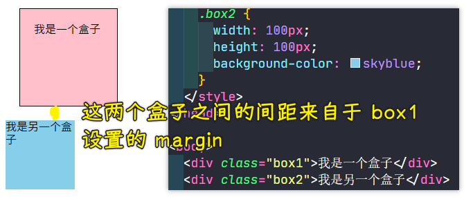

那这个盒子模型它有没有什么需要注意的点或者是它的特性呢？接下来我们一起来看一下 CSS 盒模型的注意点。

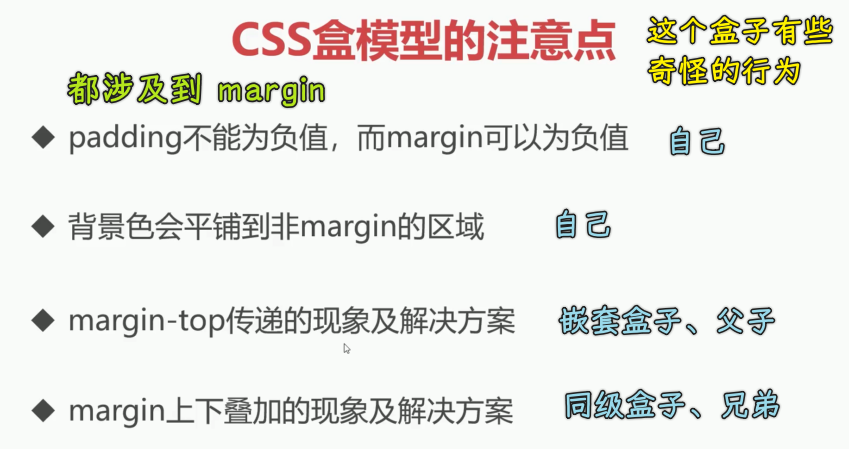

1、`padding`不能为负，但`margin`可以为负

首先第一点就是这个内填充`padding`它是不能为负数的，因为这个内填充最少就是不填充，所以它不能说是出现负的，而我们的`margin`外边距是可以出现负值的。接下来我给大家进行演示：

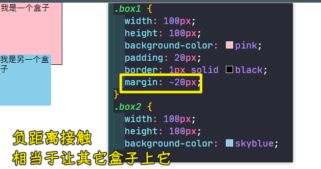

比如说在这里，我们把`box1`的`margin`设置为`-20px`，这就说明原来设置 `0` 的时候，它可能上下两个是挨在一起的，但是你做成负数之后，你会发现这个时候底下的盒子会跑到上一个盒子的上边，因为它这个 `margin` 出现负数了，它就会出现这种叠加的这个效果

所以说间距这个东西是负的，其实是会叠在一起的，而`0`正好是挨在一起的，而正值会把它们向四周扩散这样一个特点，还有你可以看到这个粉色的盒子它是不是已经出去一部分了，上面也出去一部分，左边出去一部分以及跟下面也出现了重叠的效果。

注意：如果你把`margin`设置成`-100px`这样，那么`box2`也会跟着它去的

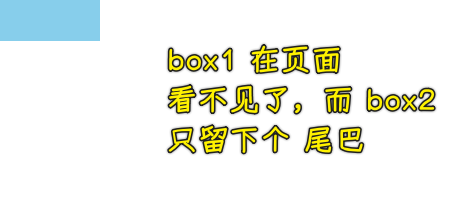

如果还有个`box3`，那么它会紧挨着`box2`：

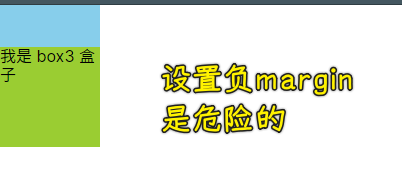

这是平级现象，如果是嵌套，给`body`一个`10px`的边框：

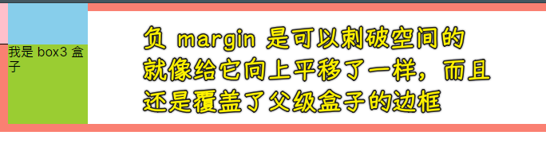

那我们再来看一下它这个还有哪些特点。

2、`border`下也是有背景色的，只有`margin`是没有的

第二个特点就是背景色它会平铺到非`margin`的区域。

`margin`区域跟我们的背景色没啥关系，它始终是默认的白色，那边框这个区域到底有没有背景色呢？其实边框区域也是有颜色的，但是为什么我们看不见它呢？因为边框把背景色给盖住了，你可以调大边框，用虚线或者是实线半透明色的，你就可以看到，边框底下是有背景色的：

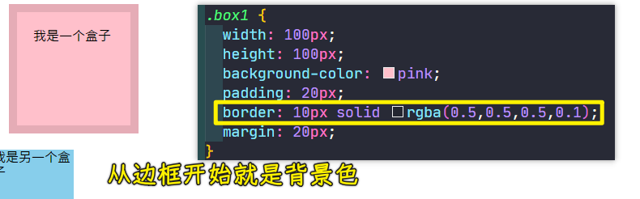

所以说我们可以发现背景色会平铺到非`margin`的区域，也就是说从边框开始就有背景色了，只不过边框是会把背景色给它盖上。

我们再来看一下第三点。

3、给儿子的`margin-top`，相当于是给父写的

第三点就是`margin-top`，其实它会有一种传递的现象，当然只是针对这个 `top` 的，如果说是左右还有下，其实是没有这个问题的。

那接下来我们来看一下这个问题：

1. 搞两个盒子，`box1`嵌套一个`box2`
2. 都给上宽高背景色
3. 给`box2`一个`margin-top`

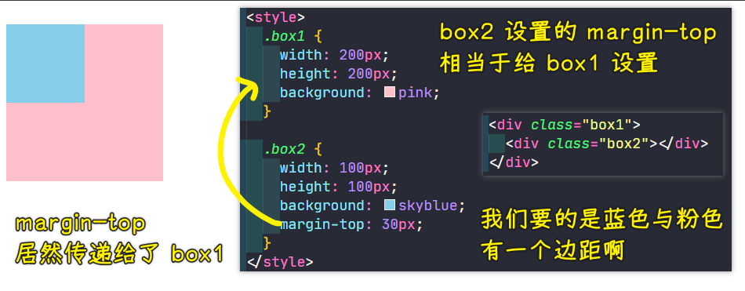

这种问题其实对我们布局来说，肯定或多或少会造成一些影响。那我们怎样解决这个问题呢？有很多种方案。

首先最简单的方案就是我们不用这个`margin-top`来做这个事了，我们可以换成`padding`来做这个事儿，就是说我们用`padding-top`也可以做到类似的效果，只不过需要稍微处理一下罢了！

第二点，我们还可以通过加上这个边框也可以解决这个问题：

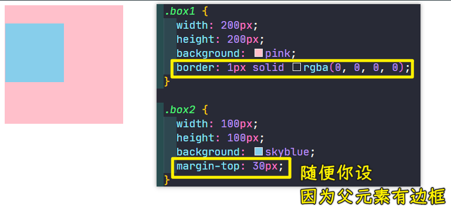

现在它就可以产生这个正常的现象了。

除了这些这个简单的操作以外，还有我们后边这个课程当中有的内容，就是 BFC 格式化上下文也能解决这个问题，希望大家可以认真的去阅读一下这个咱们那个图文当中给大家介绍的 BFC 格式化上下文是怎么回事？其实也是可以非常好的解决这个问题的。

> BFC 的原理就是让盒子形成一个独立的容器，无论里面的子元素如何折腾，都不影响到外面的元素。通俗一点来讲，可以把 BFC 理解为一个封闭的大箱子，箱子内部的元素无论如何翻江倒海，都不会影响到外部。

比如：

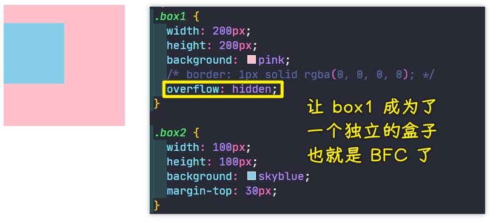

但不管怎样，大家会发现这个问题是存在的，解决手段也非常多，像什么用`padding`替代、加边框，边框可以做成一个透明的，这样就不会影响到我们这个视觉了。还有就是用 BFC 来解决这些问题。

这些方案其实都是可以解决的，但是其实并不是最好的方案，最好的方案其实还是选择用我们下一章或者是大下一章咱们要讲的内容，这些内容才是我们现代布局当中非常重要的一种布局手段，是完全可以避免这种传递现象的，那就是**弹性布局和网格布局**。

所以说现代布局其实就是把传统的我们这些问题给它解决掉。所以说在下一章以及大下一章当中是我们重中之重的内容，希望大家好好去学习。本章主要是学习一些最基本的概念，所以说咱们不会讲的那么的细了。

4、兄弟间的`margin-bottom`和`margin-top`，是可以叠加在一起的

接下来咱们来看一下这个第四个问题，这第四个问题也是`margin`出现的，在`margin`这个上下当中其实会出现一种叫做**叠加**的现象，我们一起来看一下什么叫叠加的现象。

1. 创建两个盒子 -> 是同级的，可不是嵌套的
2. 都加上宽高背景色
3. `box1`的`margin-bottom`为`40px`
4. `box2`的`margin-top`为`30px`

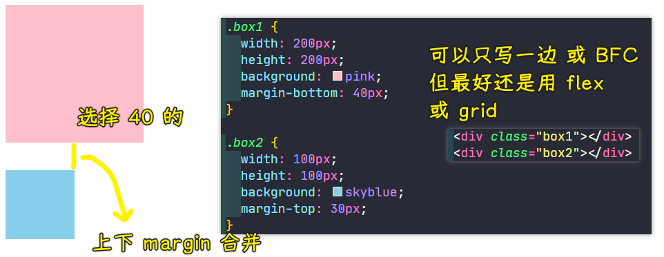

你预期这两个盒子之间的间距可能就会产生 `70` 个像素，但是实际上它们两个之间的间距真得有 `70` 像素吗？我们通过这个开发者检查工具可以明显的发现，这个间距其实是叠加在一起的，也是说它们两个之间都有`margin`，**获取它们之间比较大的那个值作为它们之间的间距**。所以此时它们的间距其实是 `40px`，也就是取它们中最大的，并不会把它俩进行累加，而是叠加这样的一个现象。

同样这个现象有时候也会影响到排版

所以我们怎么解决呢？

第一种解决方案其实就是把这个值只加给一个元素。比如说我们给这个 `box1` 加一个`margin-bottom:70px`。而下面这个`box2`盒子则不加，这就可以解决这个问题了，这是一种简单的处理方式。

其实我们在加的时候要注意这个细节，就**尽量给一个元素加`margin`，然后第二个跟它产生间距的元素，最好不要加**。

当然这个问题只出现在上下当中，如果我们的**布局是左右的话，是不存在这个问题的，左右的话，它是会很好的累加在一起的**。

我们还有一些解决方案，咱们也来说一下，比如说像刚才提到的这个 BFC 格式化上下文也可以解决这样的问题，可以让我们这个叠加的现象消失，而是正常的去进行累加，也就是 `70` 个像素。

> 把这两个盒子都套一个空盒子，让这两个空盒子 BFC 化就好了！这样它们都是独立的盒子了，只是`box1`和`box2`不同级罢了！

这些方案都可以用，但是实际上还是我刚才说的**最好的方式就是利用我们现代布局——flex 弹性布局和 grid 网格布局**，因为在它们这种布局当中，其实已经**把这些存在的已有的问题已经提前给解决掉了**，所以说在你进行后面章节的一个布局的时候，就不用再担心像什么`margin`叠加或者是`margin`传递这样的一些问题产生了。

当然，**我们了解这些也是非常重要的，因为很好的了解了 CSS 盒模型的这样的一些特性，才有助于我们更好的去学习后面的内容**。

---

这就是我们本小结所讲的一些内容了，大家可以去自己操作一下。

## ★块级盒子与内联盒子
