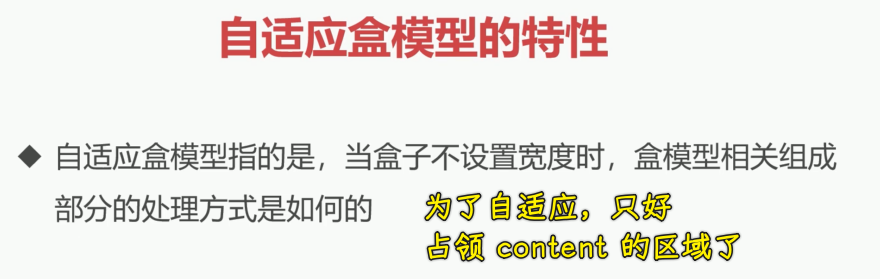
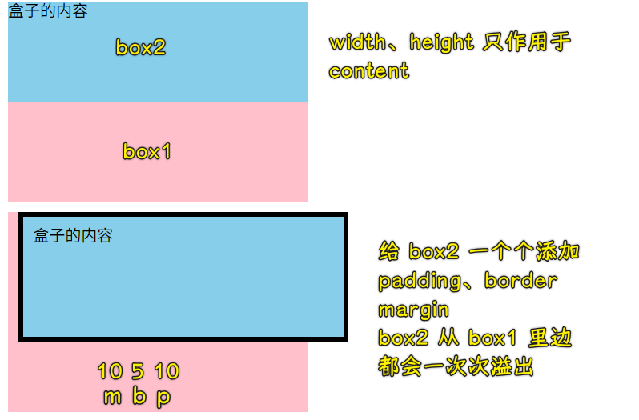
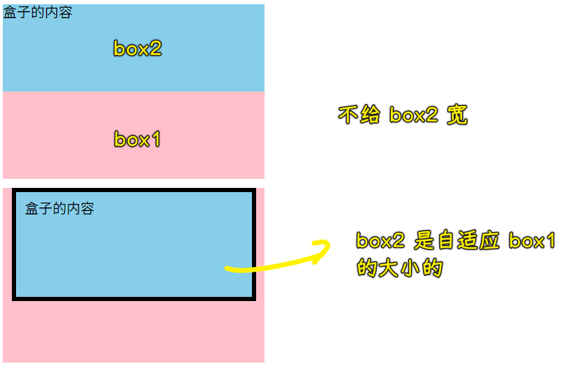

### ✍️ Tangxt ⏳ 2021-09-29 🏷️ CSS

# 09-自适应盒模型的特性、标准盒模型与怪异盒模

## ★自适应盒模型的特性

在本小节当中，我们来了解一下自适应盒模型的特性。

1）概念

先来看一下我们的概念：

> 自适应盒模型指的是当盒子不设置宽度时，盒模型相关组成部分的处理方式是如何的

2）案例

下面我们直接通过案例来给大家进行讲解。

1、儿子溢出了

1. 搞两个盒子 -> 是嵌套的 -> `box1`嵌套一个`box2`
2. 都给上宽高背景色
   1. `box1 300 * 200`
   2. `box2 300 * 100`
3. 给`box2`追加`padding 10px` -> 盒子溢出了 -> 加`5px`的边框也会溢出 -> 加`margin`也会溢出

2、为啥会溢出呢？

因为当你把`box2`这个宽高已经固定的时候，它其实就已经固定死了我们这个`content`区域，然后我们在这个盒模型当中去添加填充物以及边框或者是外边距的时候，那它自然就会把整个盒子给它向四周扩散，于是，就会产生这样的效果了。

这个效果看到之后，我们再来看个作为对比的例子。

3、如何让儿子不溢出？

如果我们不给`box2`宽会怎样？那它的宽就会跟父容器一样。

所以当不写宽度的时候，它是默认自适应整个父容器的，我们加`padding`，`box2`不会溢出，只是`content`区域变小罢了，总之**整体这个容器的尺寸是不变的**，`padding`添加就会导致`content`的区域变小，同理，加`border`，它还是会往这个盒子里面进行收缩，`content`又会变小了，这个边框也会在整个`box1`容器的内部。然后我们再来看一下我们的 `margin` 区域，我们把 `margin` 也给它添加上，加上之后我们可以发现`margin` 它其实也会添加上，并且也会往里进行收缩。

所以我们可以发现这样的特性，这就是自适应盒模型的一个特性。

3）总结

我们来总结一下，也就是说当我们不写宽度的时候，我们的盒子它再添加有关盒模型的这些值`padding、border、margin`的时候，其实**我们的这个`content`会进行重新计算**，并且会往里收缩这样的一个现象。

那这样的现象可以帮助我们做很多事情。比如说我们经常在布局的时候是需要做到这样的需求的，也就是容器得始终跟父容器相同，并且它的内容还要往里进行收缩，那这个时候咱们就不要再加宽度了，直接就可以完成这个需求。

要是不理解这个现象的同学，可能说我们的一般做法是怎么做呢？

很简单，就是自己计算呗，把`width`设为`250px`就好了，毕竟左右累计起来是`50px` -> 确定好最终收缩完成的`content`

计算完之后其实你也能得到这个一样的效果，但是实际上是没有必要的，因为如果你能理解这个现象的时候，我们完全是可以不用写宽，就能够做到这样的一个行为的。

这是我们非常重要的一个在利用盒模型来看到的一个自适应的现象 -> 理解这个现象，得多加练习！

## ★标准盒模型与怪异盒模

