### ✍️ Tangxt ⏳ 2021-10-03 🏷️ CSS

# 11-定位样式详解、定位特性注意点

## ★定位样式详解

在本小节当中将给大家介绍另外一种控制元素位置的方式，就是我们的定位。

定位要比我们上一小节讲的浮动要更加的灵活，对于我们的位置控制更加的强大。接下来我们就来看一下定位是怎样来进行操作的……

1）`position`属性是什么？

在 CSS 当中，`position`属性用来指定一个元素在文档中的一个定位方式，其中这个 `top` `right` `bottom` 和 `left` 属性则决定了该元素的最终位置。

2）有哪些定位方式？

我们的定位方式，其实它的分类也是比较多的。我们可以看到主要有这样几个可选的值：

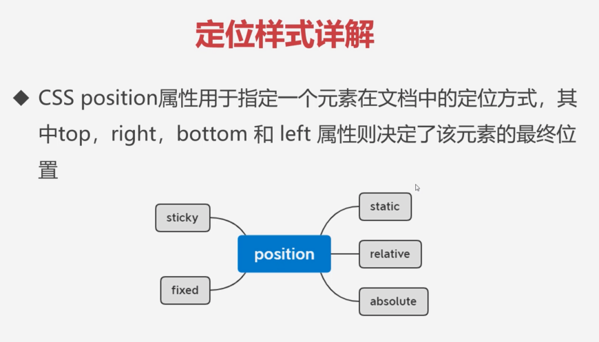

💡：`static`

其中我们的 `static` 它其实就是静态的，比如说我们的默认情况，当我们不给元素加任何定位方式的时候就是我们这种默认的 `static` 。

💡：`relative`、`absolute`、`sticky`、`fixed`

可用于定位的选项，主要有相对定位`relative`，`absolute`绝对定位以及我们的粘性定位`sticky`，还有我们的`fixed`固定定位这样几个选择。

接下来我们就分别来看一看这几种定位的方式是怎样的。

3）相对定位及特性

1、概述？

先来看我们这个相对定位及它的相关特性。

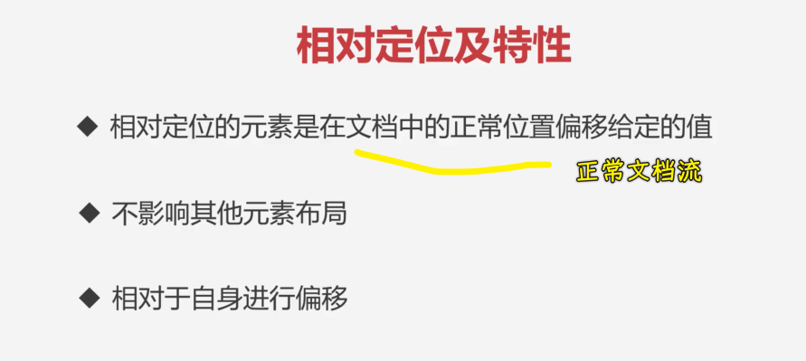

**相对定位元素是在文档中的正常位置偏移给定的值**，这就是相对定位的一个概念。

接下来我们主要来看一下相对定位具体是怎样的。

2、特性

💡：还在正常文档流，不会脱离文档流

首先大家可以看到这个概念它说了是**在文档中的正常位置偏移给定的值**，也就是说它在**正常文档流下**。所以我们这里先来给大家演示一下这个相对定位。

1. 创建三个盒子`div` -> `box1~3`
2. 给上宽高和背景色

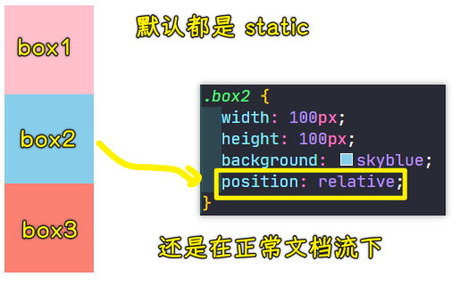

给中间的`box2`加一个相对定位。当我们给`box2`加上相对定位之后，你会发现它并不会影响到其它元素，因为它就在正常文档流下。这个大家得注意啊，它跟浮动不一样，相对定位它不会脱离文档流，它还是在正常文档流下。所以说**加上相对定位的元素，其实不会对其它元素造成任何的影响**。这是它的第一点。

接下来我们看一下第二点。

💡：不影响其它元素的位置

第二点就是不影响到其它元素布局，这里我们不影响到其它元素布局，在上个截图中可以看到，因为它在文当流下，所以说它不会影响到其它元素。

接下来我咱们再看。

💡：相对于自身四个角进行偏移

它是相对于自身进行偏移的，也就是说我们这个`00`点在哪呢？坐标 `00` 点是在方块的它的左上角。

我们给`box2`一个`left: 50px`，这其实就是相对于它自身向右移动了 50 个像素，再加`50px`，它又移动了。同理，这个 `top` 就是我们的向上的距离，如果也给 `100`，那就说明它要向下移动 `100` 个像素，所以它就移到了这个位置上了：

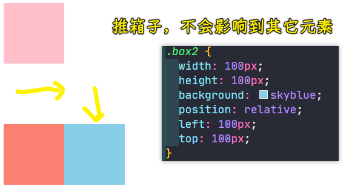

大家可以看到，这时候位置偏移之后，并没有对我们的其它元素造成任何的影响，这就是我们相对定位的特点。也就是说就算你加了偏移，也不会造成任何影响，这跟我们的外边距是不太一样的。

我们换成外边距给大家再演示一下：

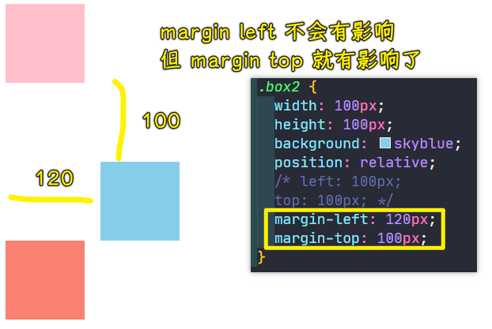

这就是我们相对定位的一个特点了，即不会影响到其它元素，关于相对定位，了解三点应该就可以了，咱们这个相对定位主要就是进行自身偏移，然后不影响其它元素展示特点。

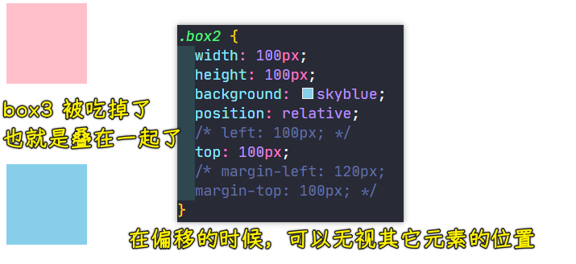

> 即便 `box3` 有内容还是如上图所示的这样被完全覆盖住

4）绝对定位及特性

1、概述？

我们来看一下绝对定位及特性，这个绝对定位要比相对定位稍微复杂一点。

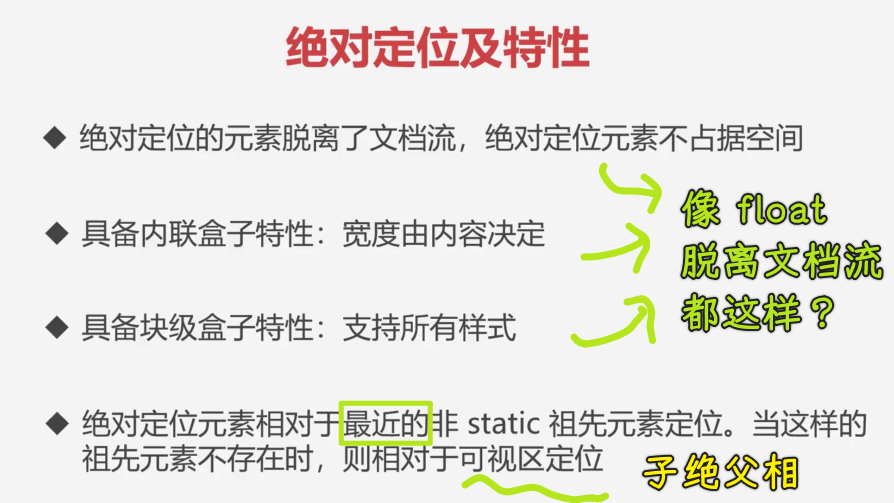

2、特性

💡：脱离文档流，不占空间

首先这个绝对定位的元素它是**脱离了文档流**，绝对定位的元素是**不占据空间**的。这一点我们先来看一下：

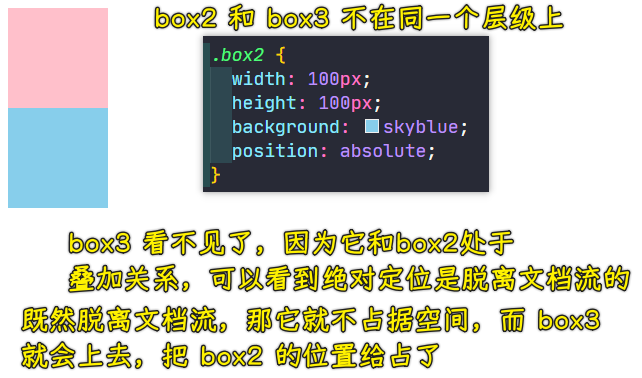

绝对定位是脱离文档流的，相当于是蓝色小方块已经跟我们的另外两个盒子不在同一个层级上了，所以说我们这个`box3`红色盒子就提上来了，也就是说它俩现在是一个叠加关系。

我们可以看到绝对定位的第一点，它是一个脱离文档流的这样一个特点。

接下来我们再来看第二点。

💡：具备内联盒子特性：宽度由内容决定

第二点就是绝对定位的盒子，它跟浮动很像，具备内联盒子特性。宽度由什么呢？由内容决定，我们来尝试一下这是在表示什么意思：

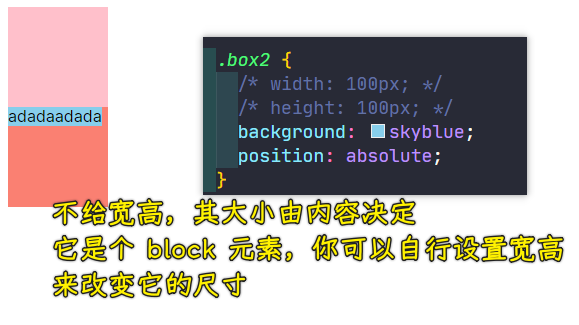

来看一下第三点。

💡：具备块级盒子特性：支持所有样式

它可以让内联盒子支持所有样式，这个跟浮动也是一样的特性，我们也可以来演示一下。

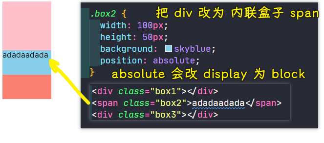

它跟浮动的特性是一样的，它也可以让我们的一个内联盒子，具备所有样式的支持。一旦当`box2`有了绝对定位，注意，这两个特性跟相对定位是没关系的，千万不要混了，这个只是说绝对定位它有这个能力，也就是说脱离文档流的元素，它们的现象是很像的。

💡：为什么会说「子绝父相」？

关于定位，还有一个比较重要的概念就在绝对定位当中：

> 绝对定位元素，它是相对于最近的非 `static` 祖先元素定位的，当这样的祖先元素不存在时，则相对于可视区进行定位。

**这一点是我们绝对定位当中非常重要的一个特性**。那这到底是什么意思呢？咱们来通过代码给大家进行演示。

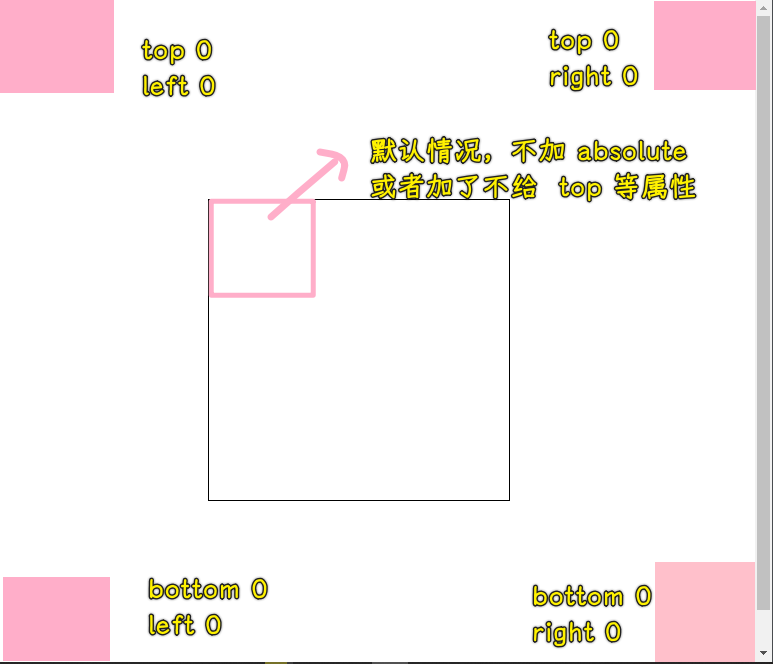

我们这个绝对定位跟相对定位是有很大区别的，就是相对定位它是相对于自身进行偏移的，也就是容器的左上角`00`点位置，而我们这个绝对定位的 `00` 点并不是在这个容器元素的左上角。

那它在哪儿呢？

你自己加上`top`和`left`就会知道了，它是会相对于我们当前可视区域作为`00`点的。

同理，如果说我们选择 `right` 和 `top` 的话，那就会以右上角作为这个起始位置，总之，它是相对于我们可视区域进行位置的控制的。

我们可以做这样一个实验，给`body`加上一个高度或者其它，加一个高度或者其它之后，页面就会出现一个滚动条，你会发现它依然在可视区的右下角，并不会在`body`的右下角。

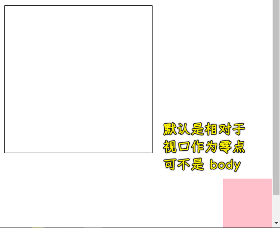

这个大家尤其需要注意一下，这就是我们的第一个特点，也就是说当`box2`它的祖先元素，比如说`box1、body`都属于它的祖先元素，它的祖先元素都没有定位模式的时候，也说非`static`的时候，它就会相对于可视区域进行定位。

接下来我们给这个`box1`加一个非`static`这样一个数值，我们给它加一个`position:relative`。加上这个相对定位之后，你会发现这时候的`00`点是这个`box1`的四个角之一：

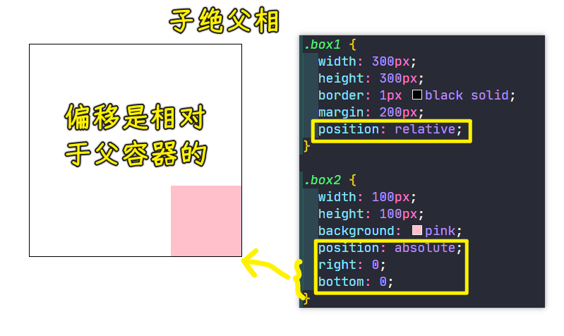

可以看到，`box2`就会相对于祖先元素进行位置的偏移，同理，`left 0 top 0`也是如此，总之，`box2`会相对于有定位模式的这个祖先元素进行偏移。

同理，我们给`body`这个祖先元素加：

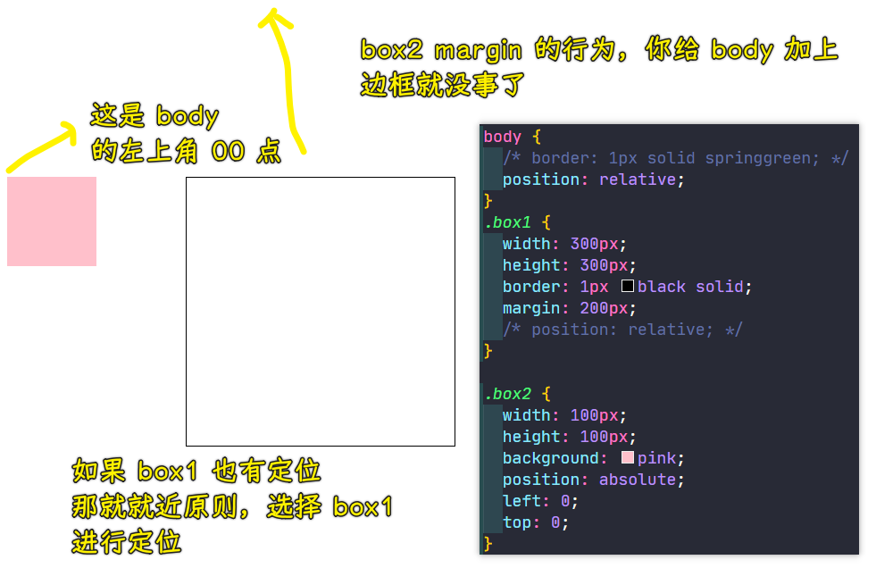

这个就是我们绝对定位的一个特点，有很多布局都是这样的一种方式，也就是说父容器我们一般加相对定位，而里面的子容器我们可以给它加个绝对定位，这样就可以针对这个当前容器进行的偏移来实现一些定位的方式，以此来**做一些叠加的效果**。

---

本节咱们就先把这个相对定位和绝对定位的特性做一个简单的了解。

## ★定位特性注意点
