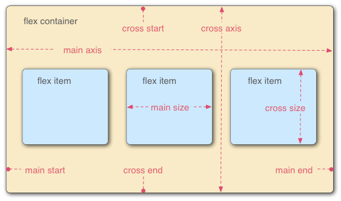
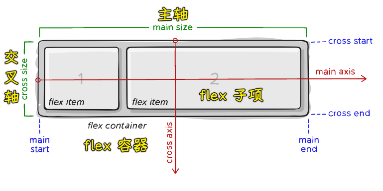
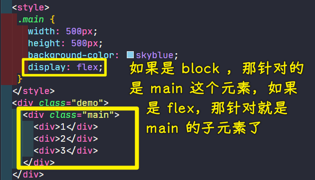
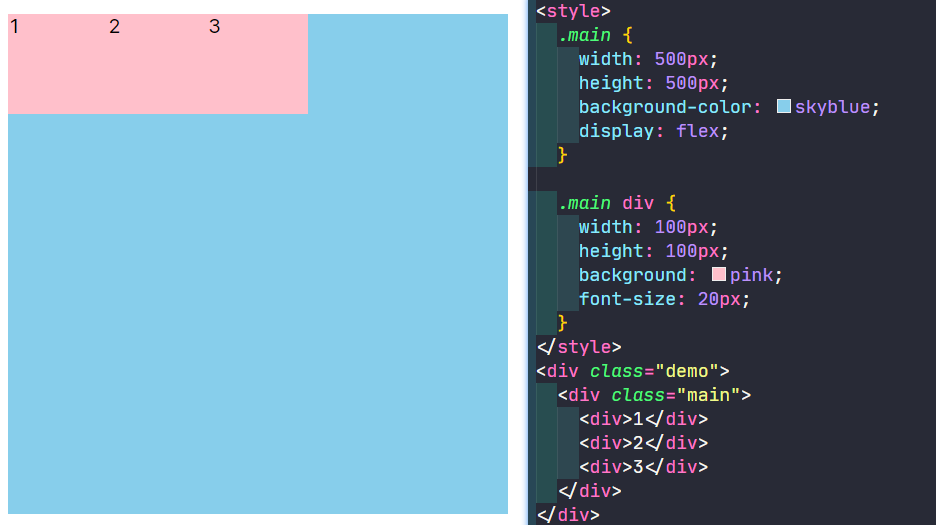
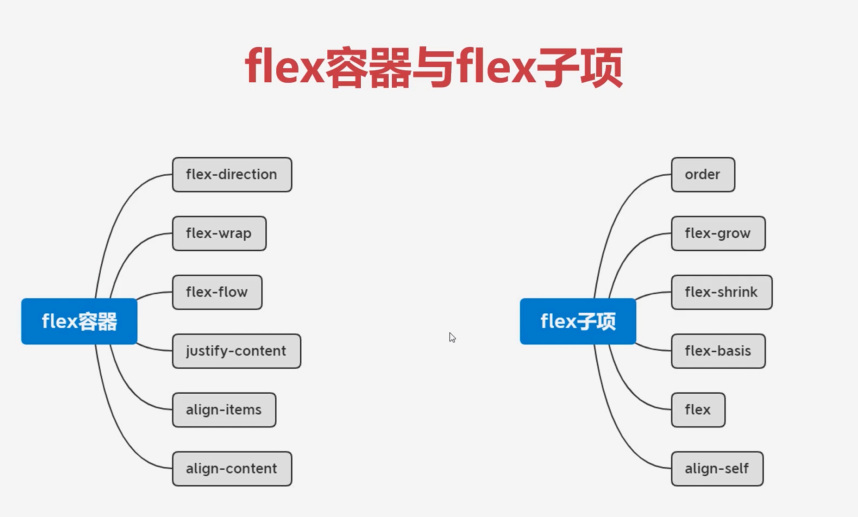
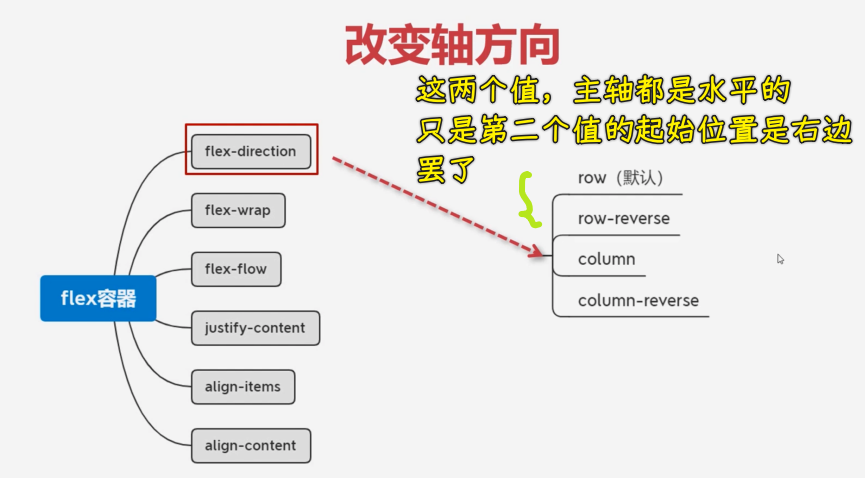
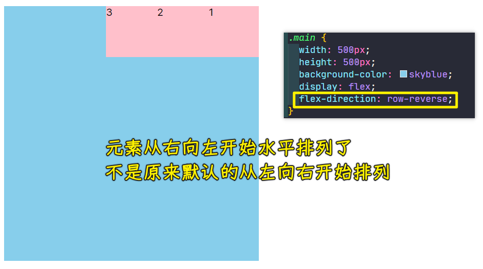
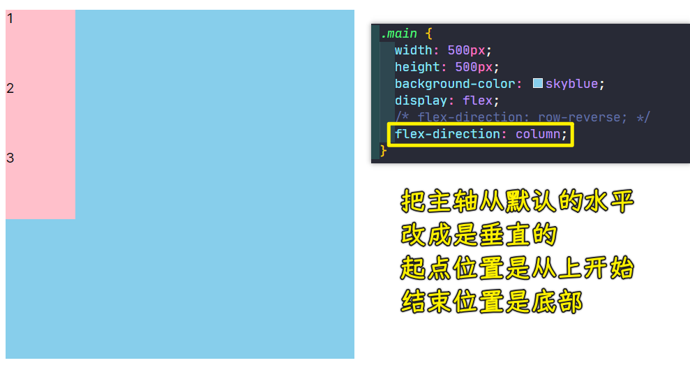
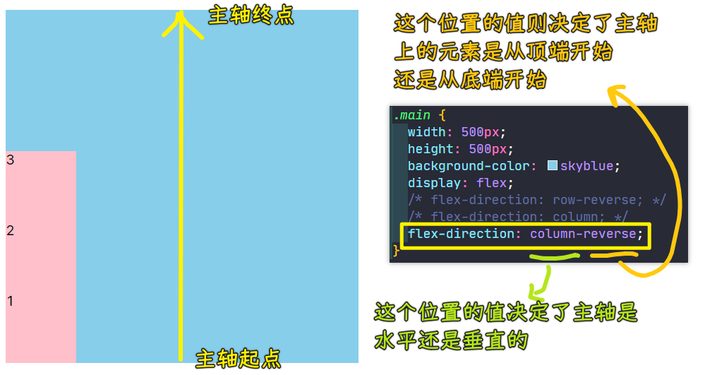

### ✍️ Tangxt ⏳ 2021-10-12 🏷️ CSS

# 18-主轴与交叉轴、换行与缩写

## ★主轴与交叉轴

本小节当中我们将学习主轴与交叉轴。

1）主轴与交叉轴是怎样一个概念？

这个知识点在我们弹性布局当中非常的重要。我们在学习之前，先来看这样一张图：

> 图 1

这张图其实（事实上）很好地诠释了我们弹性布局的一个默认的情况是怎样的，大家可以看到，弹性布局其实它是需要一个容器的，也就是我们的 `flex container`（flex 容器），除了有这个容器以外，我们还需要 `flex item`，也就是它的一个 flex 子项。

大家可以发现，在弹性布局当中，这个子项它默认是水平排列的。大家可以看到这个水平排列，这其中有一根水平线，这条线默认情况下就是它的主轴，它叫做`main axis`。

图中我们可以看到在主轴的这个起点位置叫做`main start`，也就是**起点**，而在这个主轴的最右边就是我们的`main end`，也就是我们这个主轴的**结束位置**。所以说主轴它默认情况下是**水平的**，并且是**从左到右进行排列的**。

在这张图当中，大家可以看到我们的这个`cross axis`，它其实是我们的交叉轴。在这条交叉轴当中，它其实也有起始和结束。大家可以看到这个 `cross start` 就是我们的起始，而我们的 `cross start` 就是我们的结束位置，这个交叉轴它是**垂直的**，并且是**从上到下的这样一个顺序**。

> 单个 item 占据的主轴空间叫做`main size`，占据的交叉轴空间叫做`cross size`

所以大家要把这张图先看懂。

2）弹性布局的默认情况

看懂这张图之后，接下来我来给大家进行一个简单的演示，看一下我们的这个弹性布局默认情况是怎样的。

怎么样让我们的这个容器变成弹性的盒子呢？`display:flex`就好了。顺便一提，`display`这个属性它是非常的重要，而且它这个值取值非常多，像我们的 `block` 这种，它就会把这个 `display` 的类型设置到当前的这个容器`main`身上。

而我们的 `flex` 其实它是针对里面的子元素的一个布局排列方式的。所以说前面咱们对于 `display` 详解的这个图文章节当中，也希望同学们能够认真的阅读一下，这样对 display 有一个认知。

现在我们的 `display:flex` 就是针对我们的这个子元素，它就会对他们进行一个排列组合。我们的 `flex` 加上之后，然后我们再给这个里面的子元素，给它加一些小样式。

子元素样式都加好之后我们可以看到代码运行的默认情况下是怎么样的。

我们可以看到子元素这个时候的排列水平排列的，就像我说的沿着主轴进行排列，然后从主轴的起始的位置向这个主轴的结束位置进行一个分布，这就是弹性布局的一个默认的形态。

3）能否改变轴的方向？

我们再来想一个问题，就是说我们这张图（图 1）当中的这个主轴以及我们的这个交叉轴，它能不能改变方向呢？

其实是可以的，也就是说我们可以在水平的时候，让我们的这个右侧成为我们的一个轴的起点位置。然后左侧成为这个轴的结束位置，或者是干脆一点儿，我们就让这个垂直方向变成我们的主轴儿，而我们的这个水平方向变成交叉轴 -> 这也是可以的。

所以说**我们这个布局在弹性当中，它的主轴与交叉轴并不是确定的，它们有可能是水平的，也有可能是颠倒过来的**。但是不管怎样，**这个主轴与交叉轴其实是相交的，它们分别代表着一个方向**，这个咱们可以看一下这个默认的，默认的水平方向的就是主轴，而这个交叉轴就是我们的这个垂直方向的。一会儿我们可以用代码改变一下它的方向。

4）如何改变轴的方向？

我们来看一下如何来改变这个主轴与交叉轴的方向？

1、flex 容器和 flex 子项都有哪些可设置的属性？

这时候我们可以先统筹地来了解一下 flex 容器与 flex 子项到底包含哪些可以设置的值？

大家可以看到，在这张图当中的左侧，这些属性都是给我们的容器添加的。所以说同学们，这些属性添加的时候，咱们不要添加到子项当中，它只会针对容器进行设置。而我们的子项当中也有对应的相关的属性，也不要把这些属性加给容器当中。所以说我们可以了解一下它们分别要添哪些样式，我们再分别的去进行学习就可以了。

2、flex-direction

接下来我们就来看一下我们第一个要学习的——改变轴方向，也就是我们的 `flex-direction` 这样一个属性。

用这个属性来改变轴方向，那它有几个选项呢？

💡：默认是`row`

它有四个选项，默认是我们的`row`，也就是我们的主轴水平，并且从左到右。除了这个默认以外，接下来这个`row-reverse` ，它其实也是主轴为水平的，但是它的起点位置在最右边，而我们的终点位置在最左边。

所以我们现在就去尝试使用一下这个属性，看一下会怎样。

💡：`row-reverse`

可以看到，第一个元素会排到我们的最右边，因为这个时候最右边成为了我们的主轴的起始位置，然后开始向左进行一个排列，所以说得到结果就是 `123` 这样去排列了。

> 类似阿拉伯文的书写方向是从右向左

💡：`column`

大家看到这个效果之后，我们再来看一下把主轴变成垂直方向：

我们可以看到，这时候的排列变成为这个垂直方向排列了。因为现在的主轴已经变成垂直方向，而交叉轴现在变成了水平方向，它也是从上到下的，起点位置是我们的顶端，然后结束位置是在最底端，所以说就会排成这样一个效果。

💡：`column-reverse`

同样我们再把这个起点和终点的位置给它颠倒一下，颠倒完之后，大家可以看到：

这时候的`1`元素就会跑到我们的最下边，然后这样去排列。

大家可以看到这就是我们的这个改变轴方向的一个设置方式。我们本小节就简单的先介绍到这里。

## ★换行与缩写
