### ✍️ Tangxt ⏳ 2021-10-13 🏷️ CSS

# 19-主轴对齐详解、交叉轴对齐详解

## ★主轴对齐详解

在本小节当中，我们将学习主轴对齐详解。

我们可以看到主轴对齐是采用`justify-content`这样一个属性来实现的。

1）主轴对齐有哪些可选的值？

接下来我们来看一下它可以选择的值有哪些。其实这个选择的值还是蛮多的，大家可以看到：

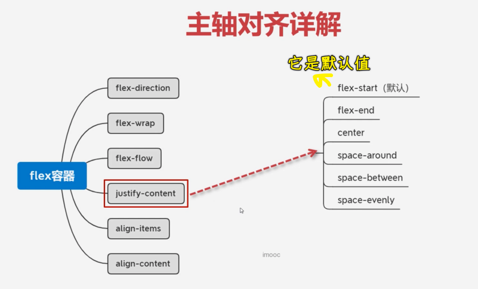

话说，这些值到底表示什么含义呢？ -> 用代码演示一下。

1、不加`justify-content`时的效果？

只有一个`display:flex`，容器默认是这样对齐的：

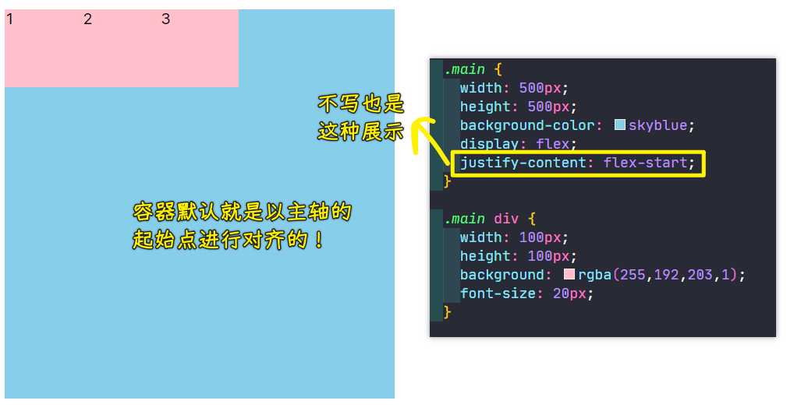

> 可以把子元素们看做三个文字，然后它们是默认的左对齐

我们可以发现它默认的就是沿着这个主轴进行水平排列，然后从左到右。

2、基本的三种对齐方式：`flex-start`、`flex-end`、`center`

这三个容器它是如何进行这个对齐的呢？可以有以下几种选择。

第一个，`justify-content: flex-start;` -> 默认全部挨在最左边

第二个，`justify-content: flex-end;` -> 全都靠到了最右边

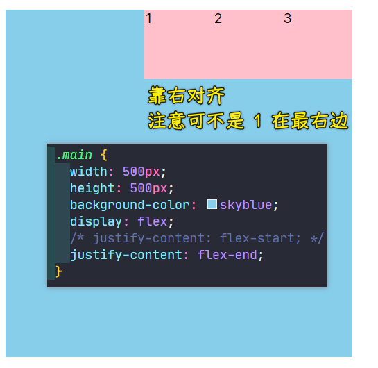

从三个子元素的对齐方式，我们可以发现这个主轴对齐方式，它就是沿着主轴到底是靠左还是靠在最右还是说做一些其它的处理。

第三个，`justify-content: center;` -> 让子元素们沿着主轴居中对齐

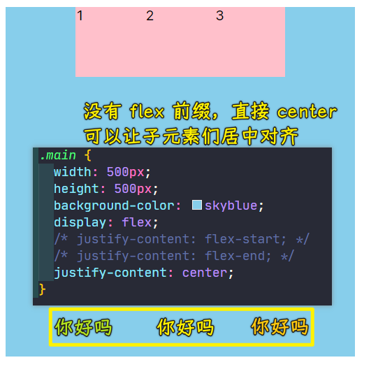

3、较为复杂点的对齐姿势：`space-around`、`space-between`、`space-evenly`

接下来我们来看一下这个比较复杂一点的。

💡：`justify-content: space-around;`？

比如说我们这个`space-around`，看一下它会怎样进行显示：

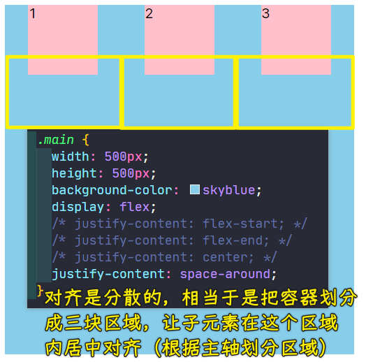

我们可以发现它会这样进行分散，这种分散的效果其实是进行了平均分配左右空间，也就是说我们第一个子项，它的左边的空间跟第一个子项右边的空间是等价的。而第二个子项的左边和右边也是等价的。第三个左边和右边也是等价的，它是这样去分配这个父容器宽度的。

这样的话，你就会发现最左边以及最右边就是中间这部分空隙的`1/2`，也就是说中间这部分空隙是两侧空隙的二倍，这样的效果我们从图中可以看到，并且这个空隙是根据父用器自动进行分配的，那这样的好处是什么呢？

好处如下：

比如我们现在把父容器的`500px`宽给去了：

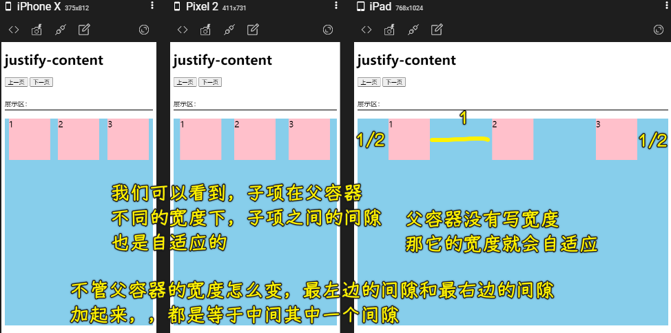

去了宽度之后子项就会自适应父容器，我们可以发现当子项自适应父容器的时候，它这个空隙也会随着进行变化。

💡：为什么我们要叫「弹性布局」？

也就是说为什么我们要叫弹性布局呢？就是说**这些间隙是可以根据我们的父容器进行一个变化的，这样的话父容器的宽度发生变化，导致它们的间距也会发生一些变化。**所以说这种弹性布局是比较灵活的，比我们的浮动布局要灵活很多。

如果拿浮动布局来做这样的效果的话，其实是不好做的。因为浮动我们要产生间隙，是需要设置这个`margin`的，也就是外边距，而设置外边距的时候，我们一般都是给一个固定的像素值。如果你是给百分比的话，这其实也是不容易做到这样一个效果的。所以说像浮动布局虽然能做左右，但是浮动做左右更多的是在一种固定的容器当中，而我们的弹性它也是做左右的，它不光是能够做我们固定的容器，而且也非常适合做我们这种自适应的容器。比如说**容器大小不同，它会自动的进行间距的调节，这就是弹性给我们带来的优势**。

了解之后，我们再把这个宽度固定回来，我们再来看看还有哪些可选的操作。

💡：`justify-content: space-between;`

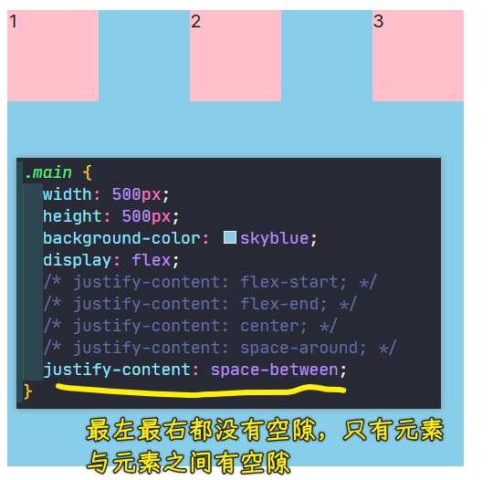

在这里我们选择这个`space-between`，也就是说我们顶到两个端点，这样的布局也是非常的常见的。开始的元素贴到我们的容器最左边，而我们的最后一个元素贴到容器的最右边，然后接下来的中间会根据元素的个数进行空隙的一个平均分配，这里面是三个，大家可以看到就会像图中这样分配。

如果再加进去一个，当四个的时候，它的一个分配情况又会是怎样的呢？

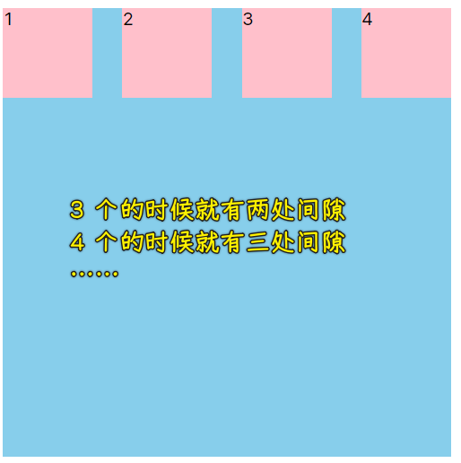

可以看到空隙也是平均分开了。然后第一个顶到左边，最后一个顶到最右边。

我们再来看一下还有什么样可选的操作。

💡：`justify-content: space-evenly;`

还有一个比较常用的就是我们的`space-evenly`，这个`evenly`是平均值的意思。我们添加之后就可以看到就会产生这样的效果：

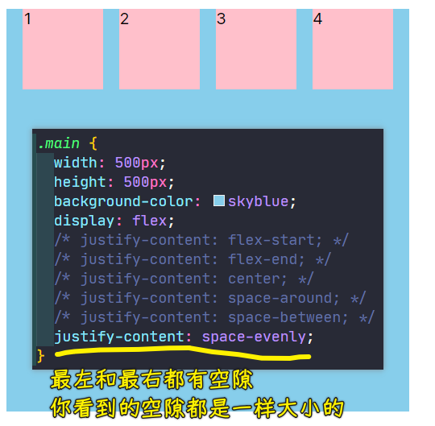

这个属性的特点就是我们这些子项之间的间距都是等价的。也就是说最左边和最右边以及中间这些空隙完全是相等的，大家可以看到这样的效果。它跟刚才看到的这个`space-around`其实是有区别的。我们的这个`space-around`它其实是我们对于子项的左右是相等的，那就会产生中间的要比两边的要大。但是这个平均分配，中间跟两边其实是等大小的，大家可以看到这样的效果，这种效果其实也是蛮好的一种排列方式。

4、折行后的子元素，又会怎样对齐呢？

大家可以看到，当折行的时候，也是可以做到这个同样效果的：

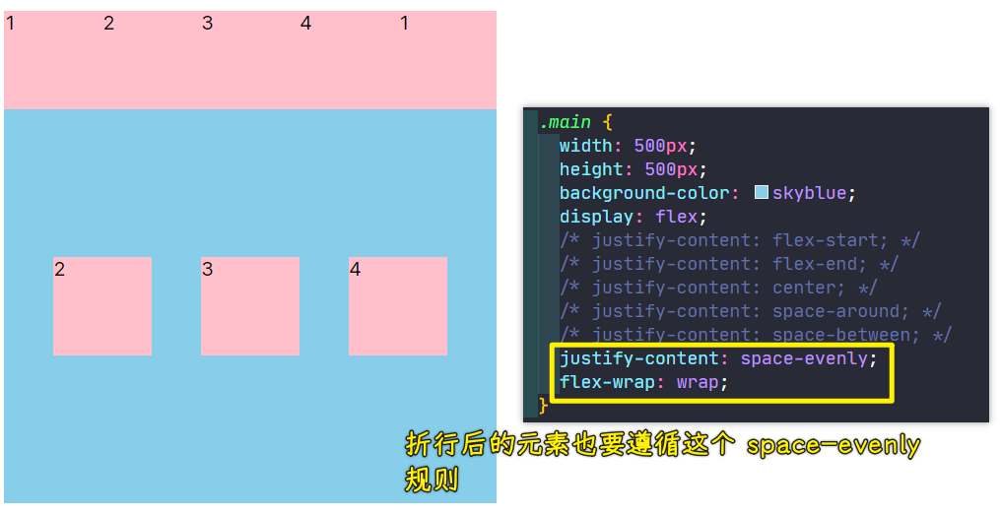

选择折行之后，大家可以看到当它（子项）排列不下的时候，当它折到下一行的时候，当还有空隙的时候，它就会做这个相应的排列方式。

上面这一行大家也可以看到，当你这个子元素已经占满了整个容器的时候，这时候其实我们的分配对齐方式`justify-content`其实并没有太大的这个影响了，因为它已经没空隙了，只有当我们有空隙的时候才能做这个布局的一个排列，这样的一个细节大家也可以看到。

5、只有一个子元素时，该子元素又会是怎样的一个对齐姿势呢？

同样，如果说假设你只有一个元素的时候，其实也要注意它的特点。比如说只有一个元素的时候：

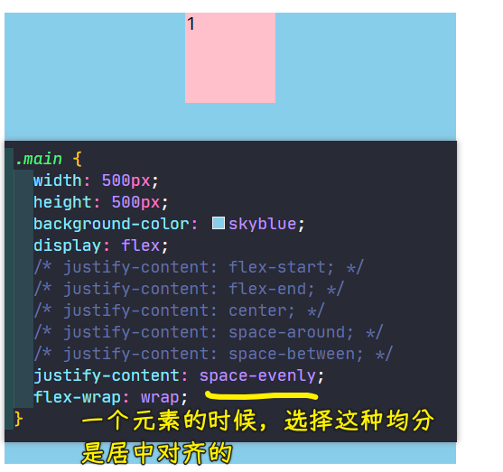

它有可能选择这种均分的时候它会居中，但是你要选择这种，比如说我们端点的这种，它就会靠到最左边：

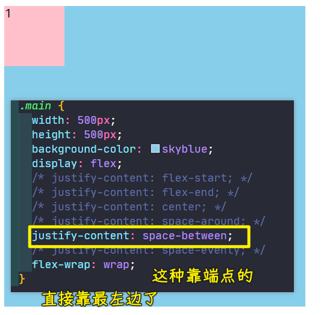

然后我们要选择这个`space-around`，我们可以看到它也会居中：

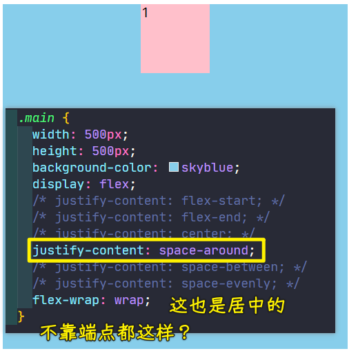

这些表现形态会稍微有些不同，一个元素其实也是可以控制的，只不过我们很少做一个元素的对齐。

2）垂直方向上的对齐

我们再来看还有哪些可以注意的点。

大家可以发现`justify-content`，它指的是我们主轴的一个对齐方式，总之，它默认是水平的作为主轴。如果我们现在是用这个垂直方向作为主轴，咱们再来看看这样的一个特点是怎样的？

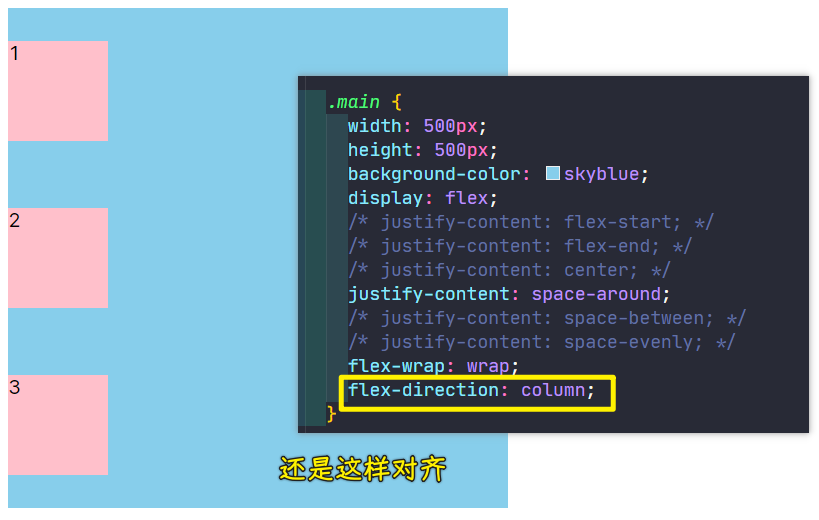

改成这个垂直方向作为主轴，大家可以看到这时候我们的主轴已经变成了垂直方向，这同样也适用于我们的这个分布，这也是进行了这个很好的排列。

所以说我们**这个主轴的排列对齐方式其实是非常强大的，可以满足我们横向的一维布局以及纵向的一维布局，这都是非常好用的。并且它这个自适应的能力是非常强大的，能帮助我们做很多好用的一个布局方式出来。**

---

在后面小节当中，我会给大家具体的去解决我们实际的例子，就是如何利用这样的特性来做出一些常见的布局方式。本讲的知识点我们就先了解到这里，希望同学们加以练习。

## ★交叉轴对齐详解
