### ✍️ Tangxt ⏳ 2021-10-14 🏷️ CSS

# 20-内联与块的上下左右居中布局、不定项居中布局

## ★内联与块的上下左右居中布局

在前面几个小节当中，我们学习了`flex` 作用在我们容器身上的一些属性语法。那为了巩固我们这些属性语法，我们接下来的几个小节当中利用 flex 容器的属性来实现一些常见的布局。

1）常见需求

接下来我们来看第一个就是如何利用 flex 来实现内联与块的上下左右居中布局。

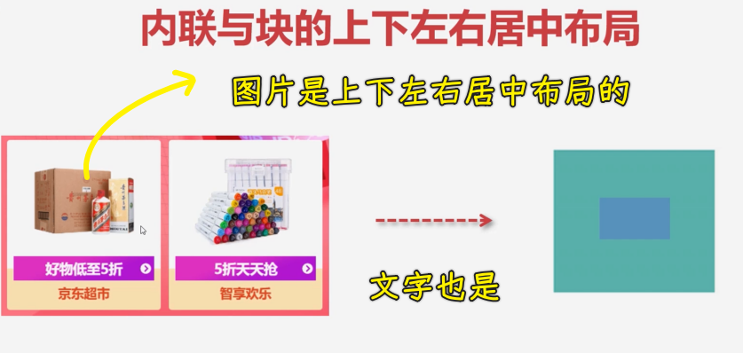

这种布局其实也是很常见的一种需求。大家可以看到左边这张图就是一个商品展示的这样一个容器，在这个里面儿，咱们的图片大小是不确定的，那它可以宽一些，也可以高一些，但不管怎样，可能都需要在容器当中，上下左右居中。不光是我们的这种图片，比如说我们的文字也经常会做这种上下居中的，并且有可能是多行居中的。那这样的话我们如何来实现呢？就是我们这种能够自适应容器进行居中的这样的效果。

那接下来我们就来用 flex 布局来简单实现一下。

2）针对内联元素的垂直居中

1、用弹性的两种姿势

两种用`flex`的姿势：

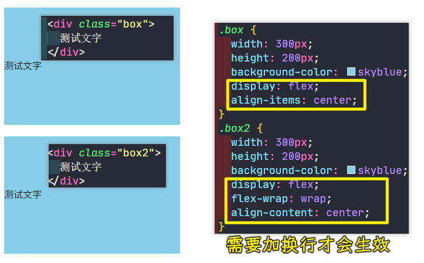

可以看到这两种做法都行，当然，`align-items: center`这种会比较简单一点儿，因为它只要写一句话就可以了，而`align-content: center`这个我们需要写两句话。

那我们接下来继续来看。

2、行高姿势

其实我们可以不用这种弹性布局，那我们用传统的布局方式能不能实现这个效果呢？

其实也可以做，我们利用行高，让行高跟父容器的高度相同即可：

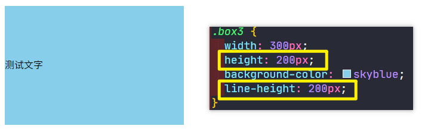

这时候也能做到居中的效果，可以看到这也是非常方便的。但是这种行高如果说针对一行文字还是不错的，但是如果针对的是多行文字的时候，这个行高就不适用了。

比如我们现在添加点文字：

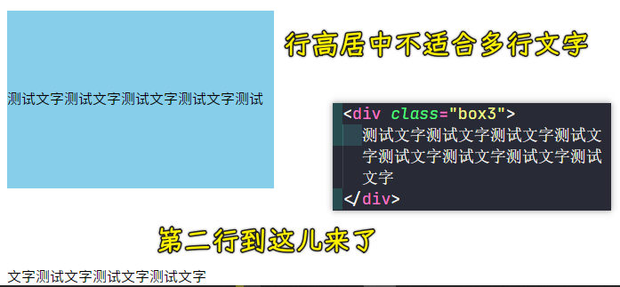

因为行高设置的跟高度一样，所以才会有这样的效果。所以说它是不适合多行居中的这样一个方式。

3、为啥推荐用弹性？没有对比就没有伤害

那我们的弹性布局就适合吗？

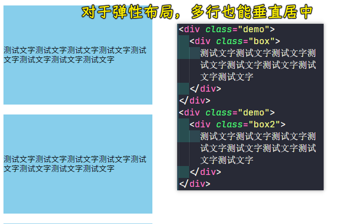

可以看到，这个弹性布局它是可以的，所以说弹性布局它还是非常灵活的，对于单行多行进行上下居中都是非常好的一种选择方式。

4、`table-cell` 配合 `vertical-align`

话说，我们就是不用弹性，那能不能做到这种多行文字的上下居中呢？

其实也可以做。不过方法比较有技巧性，我们来看一下如何来做。

很简单，用`table-cell`就好了，它可以让我们的这个盒子能变成一个类似于表格的单元格，而表格的单元格它是可以支持这个`vertical-align`的，也就是上下居中，我们选择`middle`上下居中，这样一来也能做到同样的效果：

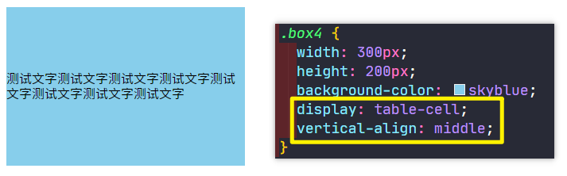

但是这就是一个需要特别记忆的方式，我们得就给父容器盒子转成为一个表格的方式。

当然，这还有一些办法，咱这里就不展开给大家讲解了。

5、小结

从上述方式，我们主要还是可以发现**弹性**是非常灵活的，而且这个通用性非常好，这是我们针对内联的一个操作。

接下来我们来看一下，如果里面是块级元素的话，看一下怎么来做这个居中。

3）针对块级元素的绝对居中

对于块级元素我们一般做这种**上下左右都可能居中**的一个效果。所以接下来我们给大家演示一下。

1、用弹性 so easy

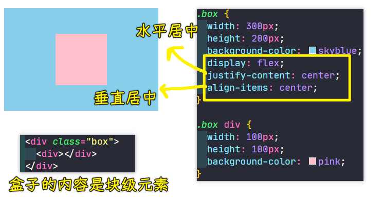

可以看到，只要`3`行就能非常容易地做到这个上下左右居中了。

这种上下左右居中，它的优点就是它可以自适应我们的父容器大小，并且也可以自适应我们这个子项的一个大小。

子项自适应父容器：

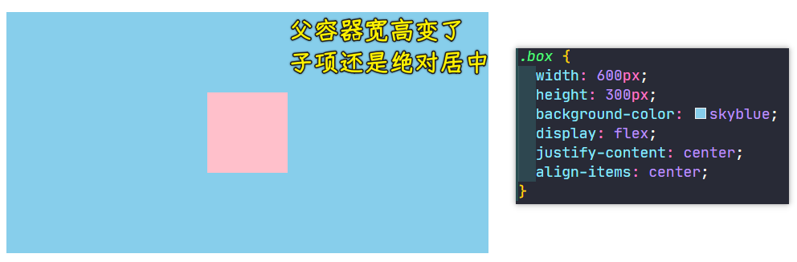

父容器自适应子项：

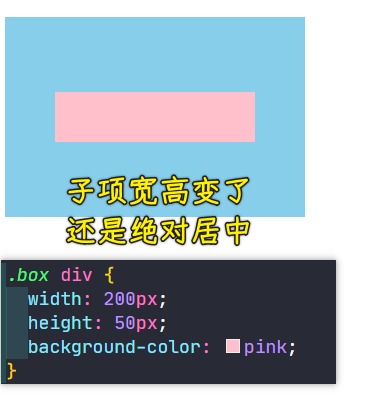

可以看到，不管父容器的大小怎么变，子项的大小怎么变，子项依然可以绝对居中。

所以这个弹性布局它的优点就是不管我们的尺寸是如何变化的，其实都非常好的能够适应这种尺寸的一个变化，这就是一种弹性的操作行为。

2、不用弹性怎么做？用定位+`margin/transform`

接下来我们看一下，如果不用这个弹性来做的话，我们好不好做呢？

这个也有方案，我也来给大家简单介绍几种。

💡：定位姿势+`margin`

我们不用弹性该如何来实现呢？ -> 这个时候比较适合用定位来实现。

1. 子绝父相：儿子
2. 儿子添加`left/top:50%`、`margin: -50px`

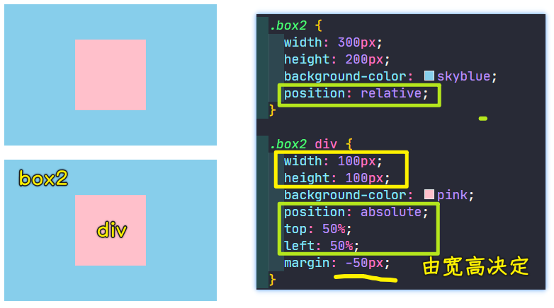

> 需要向左向右拉取 `50px`，这一点用`margin`即可

💡：定位姿势用`margin`的不足

现在的问题是，假如子元素的这个大小变化了，比如`200*50`，这时候`margin`也要进行修改：

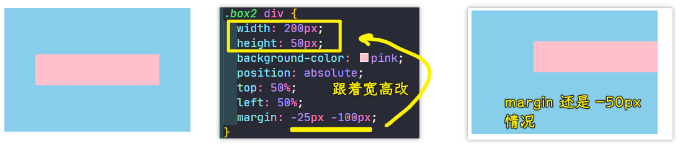

可以看到子元素宽高变了，`margin`它就需要进行调节，所以这是非常不方便的，总之，要调的数值太多了，就没办法做到我们容器能够自适应居中的这么一个方案了。

💡：不用`margin`了，用`transform`

那怎么改进呢？要想改进的话，这里面我们可以选择用我们的`transform`。

在`transform`这个变形当中，我们可以选择一个位移`translate（参数 1, 参数 2)`，位移的时候我们可以选择一个`-50%`。这个`-50%`它会相对于我们当前这个子项的宽度来进行这个计算。比如说`-50%`其实就是对于宽度的一半进行一个拉取，然后第二个参数也是对高度的一半进行拉取，这样的话就比较好一点了。

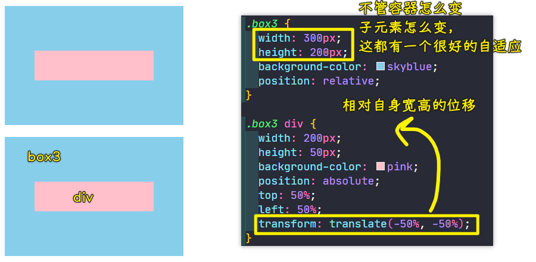

`transform`这个是相对于子元素自身进行一个拉取的。这跟`margin`拉取是不太一样的。

所以说我们可以通过这种方案来实现这样的下过，当然，这个要记的东西就比较多一些了。

3、用`margin:auto`+`flex`（或子绝父相，子的四方向都为`0`）

话说，我们还可以怎么做呢？

💡：为啥`margin:auto`只对左右有效？而上下则无效呢？

我再教大家一些小技巧。比如说我们其实会想一个问题，为什么我们不能直接用我们的这个`margin`来做这个事呢？

比如大家来想一下这个`margin: auto`，其实`margin: auto`就说明我们上下左右的这个间距应该是等价的，但实际上它只会左右进行平均分配，但上下是不会的，这就是因为我们`margin`在盒模型当中本身就有很多问题，其实有这样的问题没事，但如何来解决呢？

这个就得给子元素转成为一个 BFC 的块，当然，要想转成这个 BFC 块，这个也不一定能解决这个问题，因为这个就是盒子自身的一个问题。

💡：`flex`解决了`margin:auto`上下无效的问题

后来咱们的弹性就可以解决这个问题了。

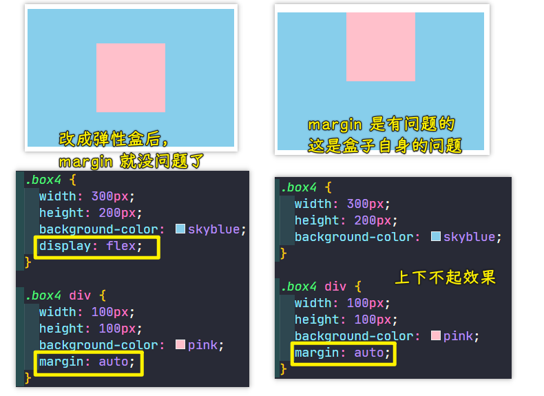

这个`display: flex;`的`flex`它就把之前遗留的这些`margin`问题其实都解决了，像什么`margin`叠加问题，`margin`的传递问题，以及像这种`auto`不能够上下自适应的这样的问题，其实弹性都给它解决了。所以说弹性布局是非常强大的，这样也能解决这个问题的。

💡：除了`flex`可以解决这个问题外，定位也能解决！

但其实方案非常多。还有一种能够让`margin: auto`生效的一种方式，除了这种弹性以外，我们可以看到，在子元素身上，我们加一个绝对定位，然后把我们的四个方向都给它设置成零的情况下，其实也是可以让`margin: auto`生效的。

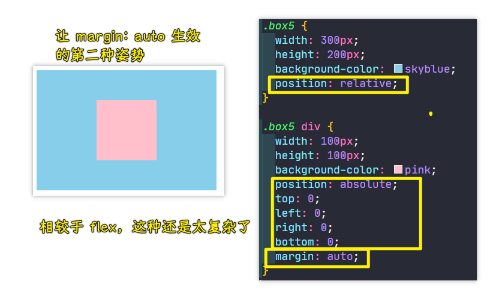

这种方案也是可以做到的。当然，我们可以这么理解这种方案，它就是一种奇技淫巧，当然，它并不是我们特别推荐的。

话说，为啥这样做能让`margin: auto`生效呢？

因为这个`margin:auto`它是没办法知道到底应该是以哪作为这个起点的，毕竟你子元素四个方向都是零，这样的话它就只能平均分配了。

4）总结

以上就是我们几种的解决方案了。通过以上的例子，大家会发现其实还是利用这个弹性的对齐方式，是非常容易做这个居中的，无论是我们的单行文本还是多行文本，它的上下左右居中都是非常方便的。而且我们这个容器的单行或者是多行也是非常方便的。

那我们配合什么呢？这个主轴对齐方式以及我们交叉轴的一个对齐方式，是非常容易调节出我们这个居中方案的。

这就是我对于这个上下左右居中的一个简单的一些案例的演示。

## ★不定项居中布局
