### ✍️ Tangxt ⏳ 2021-10-15 🏷️ CSS

# 22-flex-grow 扩展比例、 flex-shrink 收缩比例

从本小节开始，我们将学习 flex 子项上的属性相关设置。

1）`flex-grow`

我们先来看一下`flex-grow`扩展比例。

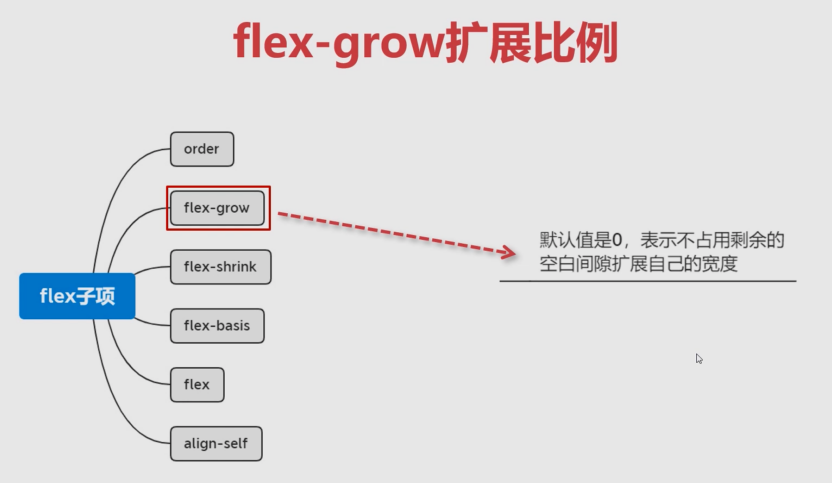

看一下这种扩展比例它指的是什么？它的默认值是 `0`，表示不占用剩余的空白间隙扩展自己的宽度，而除了 `0`以外的值，它就是可以扩展自己的宽度。它的这个属性是**不能为负数**的，也就是说它的**最小值就是 `0`**。它可以为正数，正数就表示我们是可以对这个剩余的空白区域进行扩展的。那具体的我们就通过代码来给大家进行演示这个子项的用法。

注意，该属性是加给子项的，并不是加给容器的。

2）子项默认就有一个`flex-grow: 0`的设置

默认情况：

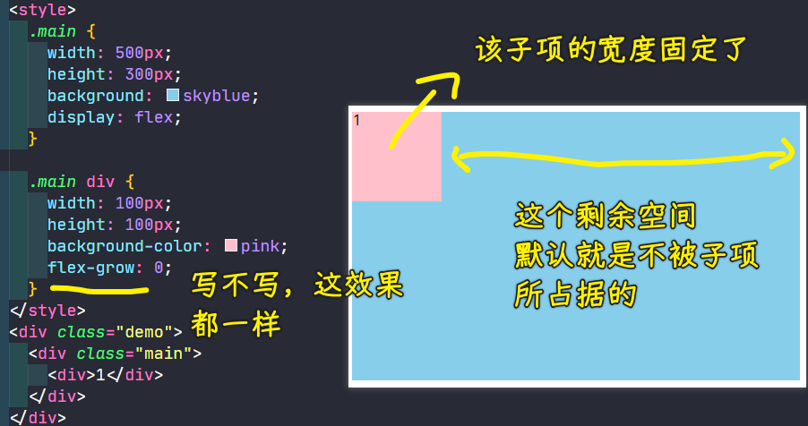

可以看到子元素默认就在这个最左边，而且它的宽度已经固定之后，所以这是没办法再去占用剩余容器的空间的，因为默认就是不占用剩余空间的，也就是说我们的`flex-grow`它就是个 `0`，它的默认值就是不占用这些剩余的空间的。

3）`flex-grow`为`1`的情况

当我把`flex-grow`的值写成`1`：

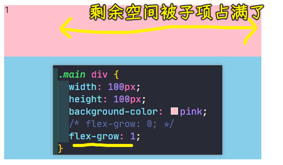

可以看到，写成`1`后，子元素就会把剩余空间的全部给占满！可以看到产生了这样的效果，通过检查控制台，能够看到它所扩展的长度，也就是宽度是可以看得到的：

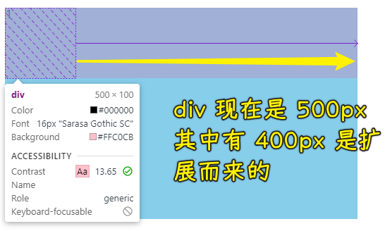

可以看到咱们的这个普通浏览器是非常智能的，如果现在这是一个弹性布局，那它这边会标上 `flex` 标识，我们点击我们的这个子项的时候可以发现在左侧这张图当中：

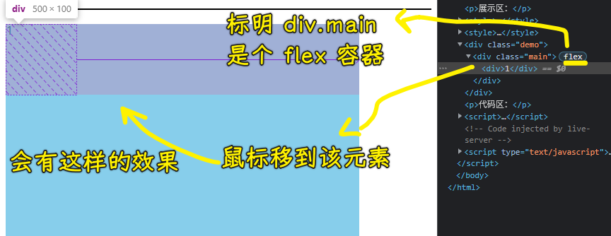

它会非常清晰的给我们做到什么呢？

非常清晰的能够看到这一块（`①`）的区域，其实就是我们的容器的一个真实的宽度：

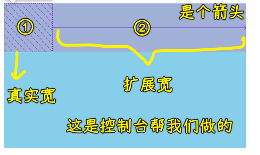

也就是自带的这个宽，也就是`width: 100px`。而这时候它会把这一块（`②`）做一个箭头出来，其实这是一个扩展的宽度，表示它是扩展的宽度。所以现在这整体目前是这样一个 `500` 的宽度，但实际上这是**分成了一个自身默认自带的宽，加上一个扩展的宽，总共才是它现在的宽度**。这就是我们的控制台能够帮我们查看到一些**非常有用的信息**。

4）`flex-grow`为`0.5`的情况

把`flex-grow`设置为`0.5`又会怎样呢？

你会发现它就会显示成这个样子：

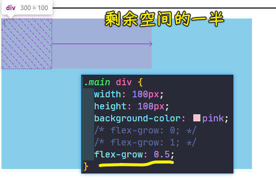

话说，这个`0.5`的比例值究竟是起到什么样的一个作用呢？

其实是这样的：

- 如果这个比例值为`1`，那就占满剩余的所有的空间
- 如果是`0.5`，那它其实就会把剩余空间给它做了一个折半的这样一个大小。

比如说我们整个容器是 `500`，咱们子元素默认宽是 `100`，这就说明它的剩余空间是`400`，而现在我们给的`0.5`，所以`400*0.5`这才是它最终所要占的一个大小，占 `200`，再加上原来的 `100`，所以它现在其实总共应该是占 `300` 来宽。

这就是为什么子元素能得到这样一个结果（`300*100`）的原因！

5）`flex-grow`大于`1`的情况

如果`flex-grow`的值大于`1`，这时候又会怎样呢？

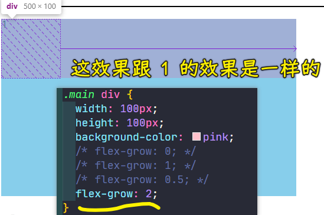

可以看到这效果其实跟 `1` 的效果是一样的。

我们可以得出这样一个结论：

> 当这个比例值大于等于 `1` 的时候，其实都会占满整个空间。

这样的话，这个写 `1` 、写 `2`、 写 `3` 其实得到的效果是相同的。

以上就是我们有一个元素的时候的一个效果了！

6）两个元素时，剩余空间按比例分配

接下来我们来看一下，当我们有两个或者是三个等这样的多个子元素的时候，子元素这个占满剩余空间，它又是怎样分配的？

1、默认情况

两个元素的默认情况：

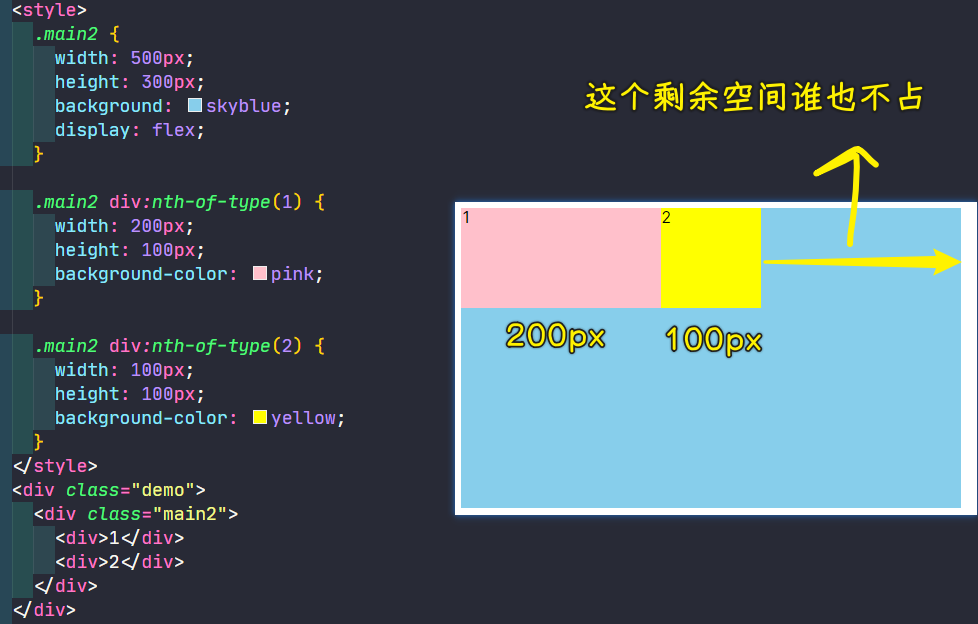

可以看到剩余空间其实还是有的。那大家想想现在的剩余空间是多少呢？

总共的容器是 `500px`，然后刨去我们的这个第一个元素所占的宽度，以及第二个元素所占的宽度之后，那剩余的空间其实只有 `200` 个像素了。

2、给其中一个元素`flex-grow: 1`

既然剩余空间有 `200`个像素，那直接给第二个子元素来一个`flex-grow: 1`，那该子元素是不是就会把剩余的那 `200` 全部变成自己的呢？

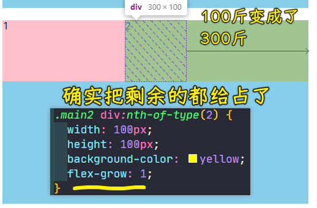

可以看到第二个`div`它现在就变成了`300`个大小了。从图中可以看到它所占据的这个扩展比例一块的距离，就是把那个 `200` 全给占上了。

同理，假如我把这个值拿给了我们的第一个，而不添加给我们的第二个：

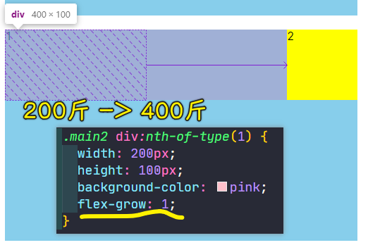

可以看到第一个`div`就把这个 `200` 占为了自己的容器的一个大小了。所以整个第一个就变成了 `400` 个像素了。从控制台提供的审查元素工具中可以看到它的实际初始值是 `200`，然后扩展的是 `200`，这样总共加起来就是 `400` 个像素。

3、两个元素都设置了`flex-grow`，且这俩设置的值都大于等于`1`

接下来最复杂的其实就是当它们两个都有这个扩展比例的时候会怎样？

其实都有扩展比例的时候，这时候就会对剩余空间进行这个等比分配。比如说：

- 剩余`200`，这俩元素的`flex-grow`都为`1`，那剩余空间就各自占一半呗！ -> 这是成比例分配的！

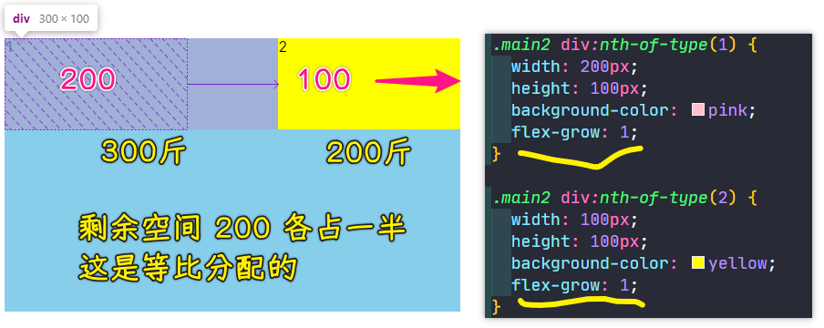

如果现在第一个是 `2`，第一个是 `1` 的话，这又会怎样呢？

这就会把剩余空间分成`3`份，第一个就会占`2/3`，而第二个则是占`1/3`

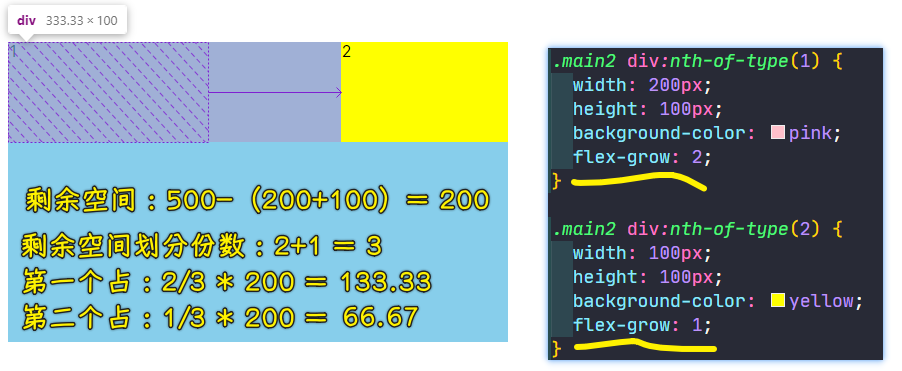

我们可以明显发现那个箭头一块的间距是一个 2 比 1 的关系：

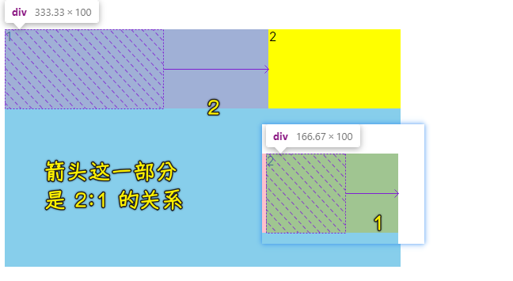

所以说这是把`200`分成 3 份，然后再分别去设置一下。

这个也是很简单的，也就是说我们这种扩展比例就是这样来设计的。

4、两个元素都设置了`flex-grow`，且这俩设置的值都小于`1`

同理，如果它俩累加的时候不满足大于等于 `1` 的时候，这会怎样呢？

比如第一个`div`是`0.2`，第二个`div`是`0.1`：

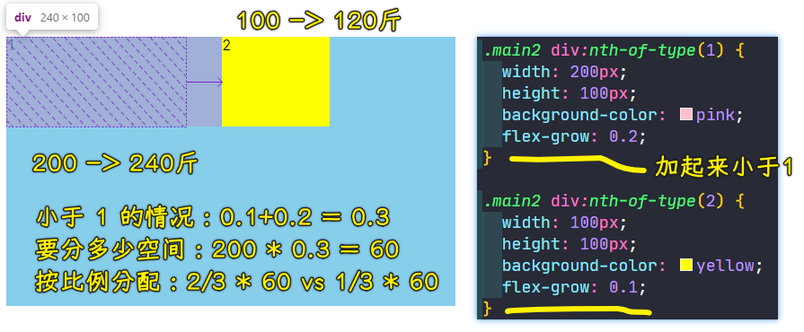

可以看到，这时候容器它还会有剩余空间。也就是说目前我们把剩余空间分成 `10` 份的话，那第一块它会占`2`份，而第二块则会占`1`份，那剩余的 `7` 份其实还是会在这个剩余的空间这一块儿来表示。

> 200 -> 分 10 份 -> 平均一份 20 -> 第一个`div`要两份，第二个`div`要一份！

所以说这个空的空间其实占了之前剩余空间的 `7` 份，而「一」这个元素它其实占了两份儿，而我们「二」这个元素它其实占了一份儿。

7）总结

好好瞧瞧这里面的这个关系，也就是说`flex-grow`这个 `1` 作为临界点是非常重要的，大于等于 `1` 的时候是**占满整个空间**，如果说是小于 `1` 的时候，它其实并**不会占满整个空间**。而当**多个元素**的时候，它是会把这个比例值进行一个重新分配的，它会根据咱们这两个元素之间的**比值关系**来自动的分配剩余空间应该占比多少。

希望同学们能够自行的去尝试一下，来感受一下这种扩展比例给我们带来的这个分配的情况。

## ★flex-shrink 收缩比例
