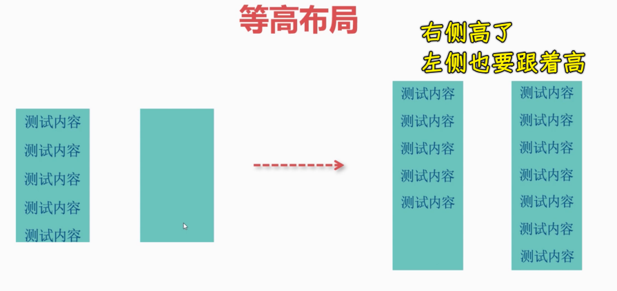
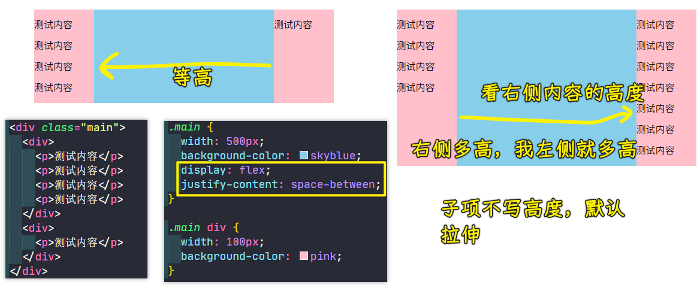
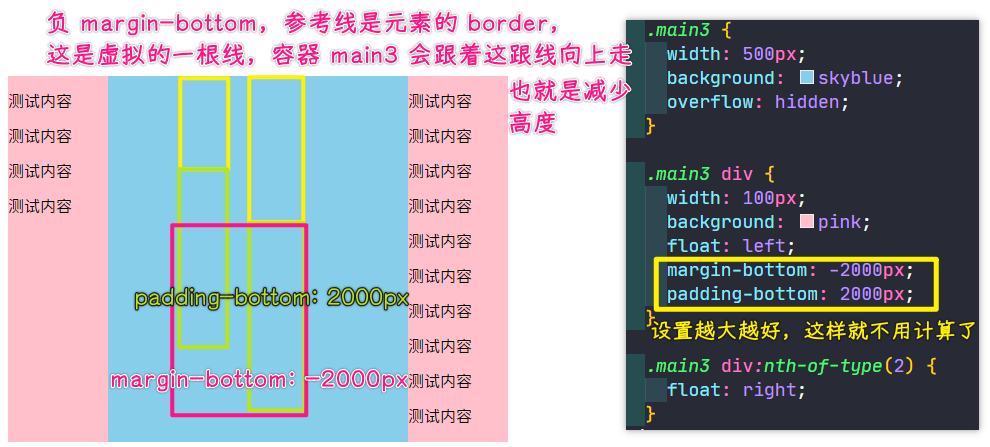
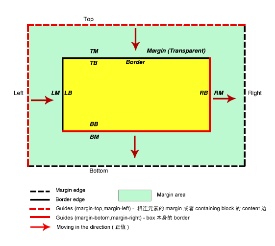
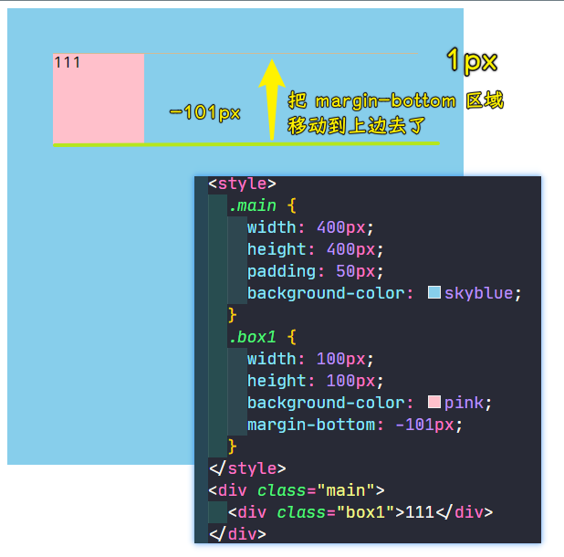
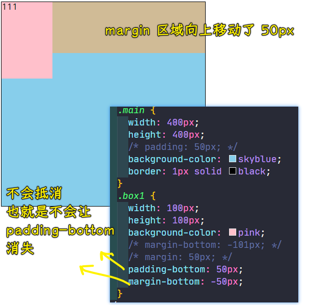

### ✍️ Tangxt ⏳ 2021-10-16 🏷️ CSS

# 24-等高布局、两列与三列布局

## ★等高布局

前面我们已经介绍了 flex 子项的相关语法。那接下来我们利用 flex 的子项来做一些常见的布局方案。首先先来看一下等高布局。

什么是等高布局呢？大家可以看到这张图：

也就是说当我们有**多列**这样排列的时候，如果其中一列的内容比另外一列的内容要高的时候，它俩的高度是相同的。这时候不管是左边的一列还是右边的一列，其实都是可以等高的。

比如说图中右边这张图，当右侧的这个内容高于左侧的内容时候，它其实也会把左侧的高度带到跟右侧一样的高度，这就叫等高布局。

那这种等高布局，如果说用传统的比如说浮动，包括一些盒子模型来做的话其实是非常麻烦的，当然，这也不是说不能做，只是比较麻烦罢了！而我们用弹性布局来做这种方案是非常容易的，因为弹性布局当中它默认的这个子项就是拉伸的，也就是说我们这个`stretch`的一种默认姿势。

那接下来我们就一起来看一下如何来做。

1. 父元素：`div.main` -> `flex` -> 端点对齐 
2. 子元素：有两个`div1`、`div2`
3. 孙子元素：`div1`旗下有四个子元素

当这个左侧这一列它的内容多的时候，其右侧这一列也会自己撑开，因为这个子项默认就是一个拉伸的`align-content: stretch`，所以用 Flex 是非常容易做到等高布局。

同理，我们让右侧的内容更高，即多加几个`p`元素，从图中可以发现当右侧这个内容比较多时，左侧也能够自动拉伸。

实现这样的效果其实是非常简单的，为啥这样说呢？因为弹性默认就是这样一个特点，做这样的等高布局，可以说是 so easy！

除了这种弹性以外，我们用传统的这个浮动能不能同样做到呢？

其实也能做，但是比较麻烦。

这里我给大家稍微演示一下，大家知道一下这个怎么做就行了 -> 其实它比较繁琐。

> 为啥设置`margin-bottom`会抵消呢？ -> 个人猜测，触发 BFC 清除浮动，会多出一个无内容`div`，它一直在容器的最底下，当我们对设置第二个元素设置`margin-bottom: -2000px`时，那该无内容`div`就会上移了！ -> 一个浮动底下会有一个`div`，必须都设置`margin-bottom: -2000px`才会起作用！

💡：题外话，关于负`margin`？

当`margin-top、left`为负值的时候与参考线的距离减少，当`margin-right、bottom`为负值的时候参考线就向左、上面移动 -> 简单来说，就是元素的`margin-top、left`为负值时自己会移动，元素的`margin-right、bottom`为负值时，相邻的右边元素或下边元素会移动！

这跟参考线是虚拟的……参考线在谁身上，那这跟线所代表的元素是不会移动的！但参考线实际是虚拟的，它是会移动的！如相邻上下两个元素，下边这个元素有`margin-top: -50px`，此时参考线是在上边这个元素，所以在显示的时候不管下边这个元素的`margin-top: -50px`如何上下移动，这个上边元素它是不会移动的！所以下边元素会向上移动的！当你对上边元素设置`margin-bottom`为负值时，那参考线就是在自己身上了，那自身就不会有上下移动的变化了，它会影响到它的下边元素，即下边元素会往上移，如果没有下边元素，那么父容器，也就是包含块的高度就会减少了！

---

好。那这样的话，为了给大家演示，咱们把这一块先注释一下，然后我们重新的写一样我们的结构，这里我们选择也是一样的布局。不过我们把这一块内容先给注释起来，让我们左侧先有内容。
接下来我们在这里面来做这个事，首先这一块都是不变的，只不过我们现在选择的是浮动布局。那这里我先简单的清一下活动，咱们用这个 BFC 简单清洁浮动。好了，这里我们选择让两个元素分别是一个左互动，一个右浮动。所以说我们这个选择一个左互动。然后第二个元素我们要选择一个右侧。比如我们在这里吗，把的个也就是我们的第二个好给它做一个右腹动，左右互动有了之后，我们接下来运行下，看一下现在目前的效果会是怎样的。
刷新一下，大家可以看到左侧这一块确实撑开了，但是右侧它没有内容，它是不会撑开的，如何让它的这个显示的内容也能显示出来这个容器的空间呢？好，这里咱们是用一个技巧，也就是说我们给这个子项加一个妈金包什么，然后这个妈金包子我们选择复数，这个副助可以稍微大一点，多大都行，但是是个负的，这样话会产生一个什么现象呢？也就是说赋值，它会把我们的容器给它缩小，容器撑不开了。因为你想想如果说是一个正式的话，它是会把容器撑开的，但是一个负值就会让容器永远撑不开。
那怎么能够让这个容器自动的能够跟互动器相同呢？相互抵消，我们再来一个判定，也就是说判定的时候这两个其实就相互提销了。同样的正的相互抵消之后，问题是我们现在这个判定它是会充当我们盒子模型的一部分这个内填充的。所以说我们接下来看到的这一块，就是一个内填充的区域，瞅上去好像是撑开了，但是实际上其实高度是没有的，只不过我们这边是个，内填充好。这样的话我们在右侧给它加多个的时候，大家可以发现，你看右侧这一块其实内容有了对吧，然后这是真正的内容，一块也是它的内容，但是这个多出来这部分其实就是我们的内填充安定的区域，只不过我们潘静和妈这一抵消，其实这个高度就不存在了。不然的话假如说你光加一个判定的话，其实你会发现看到没它就会出现这样的现象。明白，也就是说我们这个是一个障眼法，你看这个高度它占这么高，但是实际上它这个判定会非常长对吧，那我们怎么能够让这个容器收回一些呢？其实是我们一相互抵消，自然这个它就收回去了。
当然了，这个方案其实非常的繁琐，知道一下就好了，现在已经不太推荐这么去用了。大家可以发现现在我们这个现代布局当中，用弹性来实现这种等招，其实是更合理的一种方式。这个了解一下它是一种技巧，得利用这个赋值相互抵消，然后用判定来充当这个障眼法。那这就是我们的这个等高布局，希望同学们多加练习。
