### ✍️ Tangxt ⏳ 2021-10-07 🏷️ CSS

# 03-height 深入理解之 IFC

## 排版概念

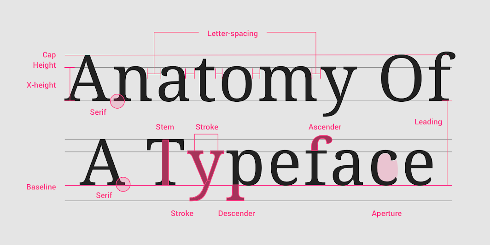

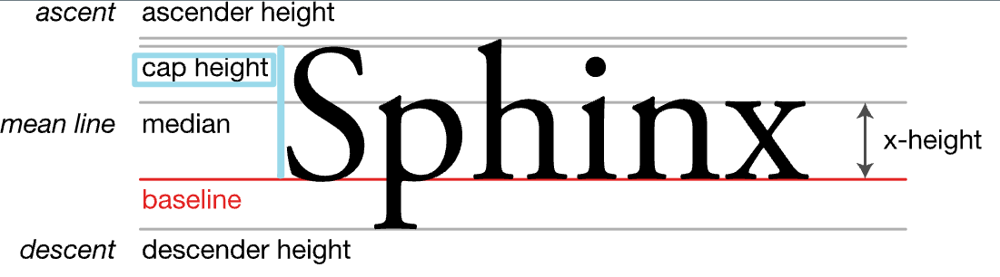

💡：Cap height：指字体的大写字母（如 `M` 或 `I`) 从基线开始的高度。每种字体都有一个独特的 cap height

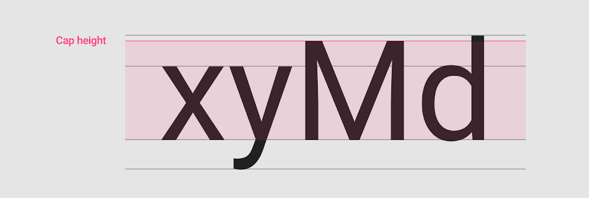

💡：X-height：字体的小写`x`的高度决定了它的`x-height`

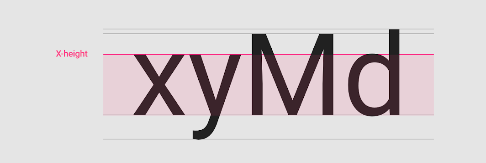

💡：Ascenders and descenders

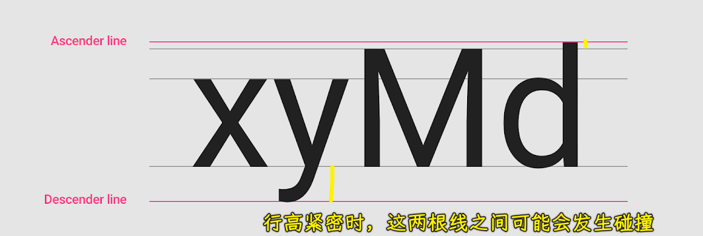

💡：Weight：指字体笔画的相对粗细。 字体可以有多种粗细； `4~6 weights`是字体可用的典型数号

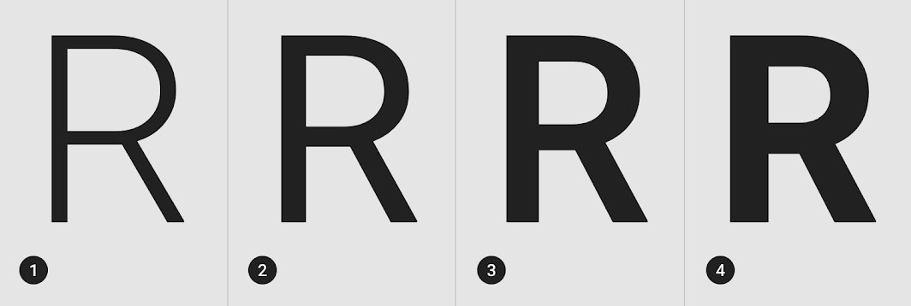

常用 weights：

1. Light
2. Regular
3. Medium
4. Bold

💡：字体类型分类？

Serif（衬线） 和 Sans Serif（无衬线，sans 是法语，其英文含义是 without）

Serif：

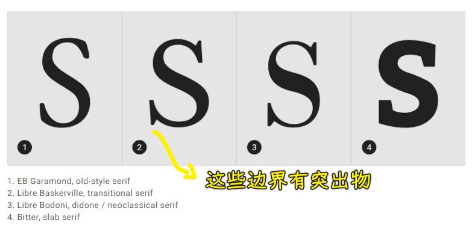

Sans Serif：

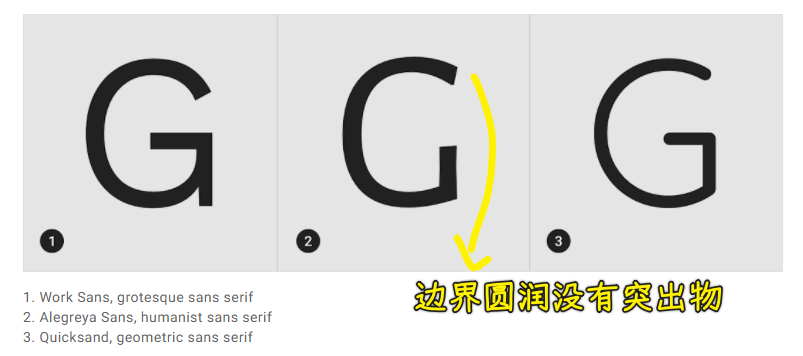

Monospace：

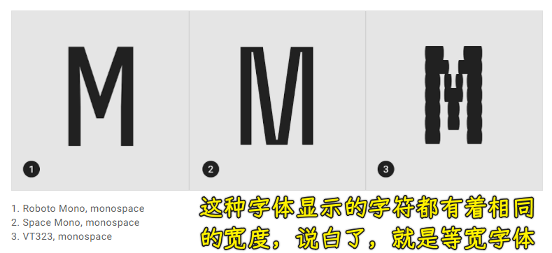

Handwriting：

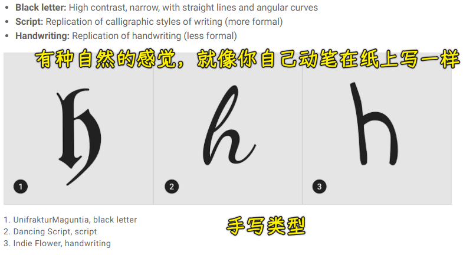

Display：

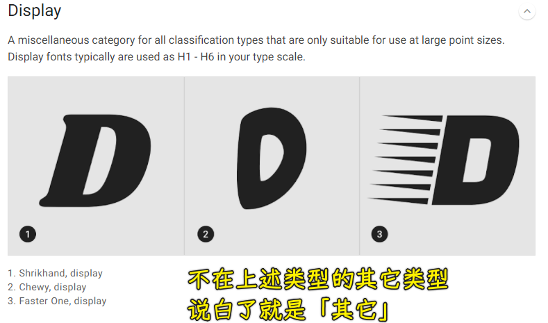

💡：易读性

易读性是由字体中的字符决定的，而易读性是指阅读单词或文本块的难易程度，这受到字体风格的影响。

1. Letter-spacing：字母间距。
   1. 字体大，间距较小，如标题，使用更紧的字母间距，以提高可读性和减少字母之间的间距。
   2. 对于较小的字体，较松的字母间距可以提高可读性，因为更多的字母间距增加了每个字母形状之间的对比度。全大写的文本，即使是小字体，也因为增加了字母间距而提高了可读性。

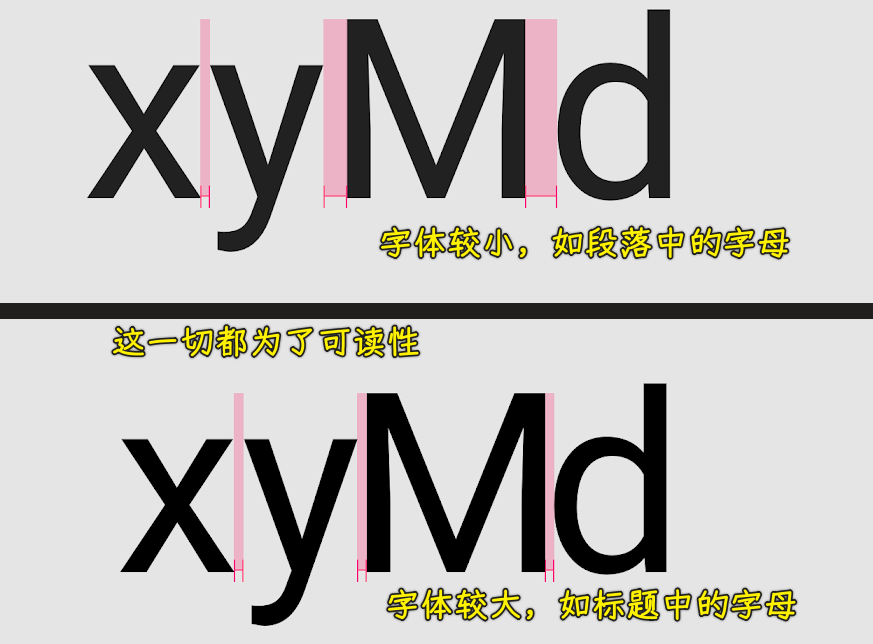

Tabular figures：

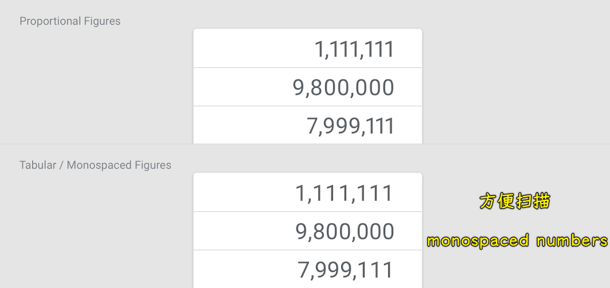

2. Line length

正文文本的行长度通常在 40 到 60 个字符之间。在行长度较宽的区域，如桌面，包含 120 个字符的较长的行需要将行高从 20sp 增加到 24sp。

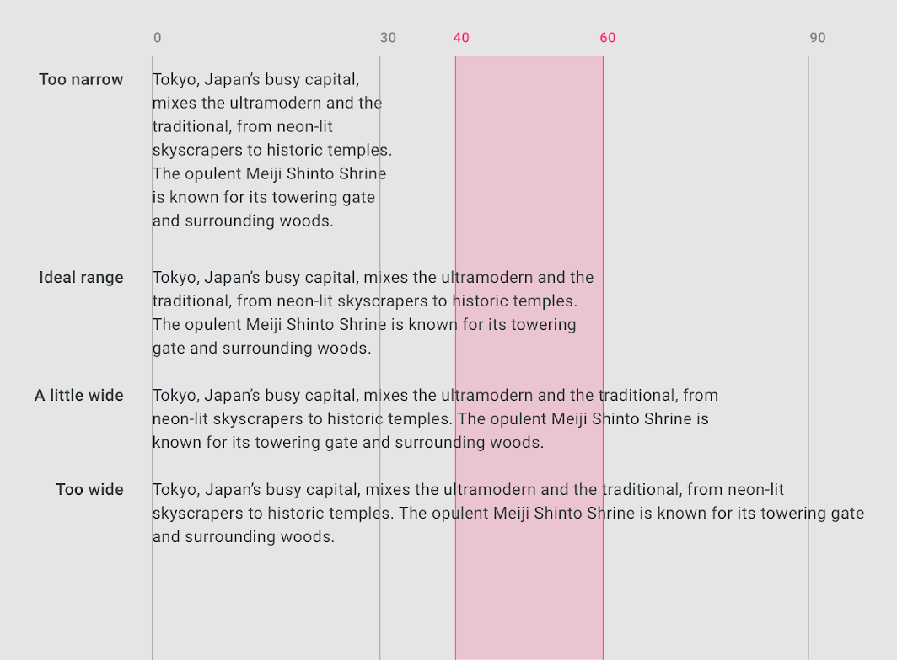

对于英文文本的短行，理想的行长是每行 20-40 个字符。

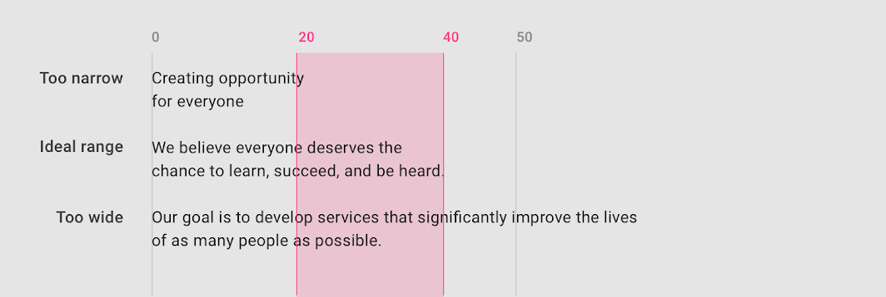

3. Line height

行高，也称为行距，控制文本块中基线之间的间距。文本的行高与字体大小成正比。

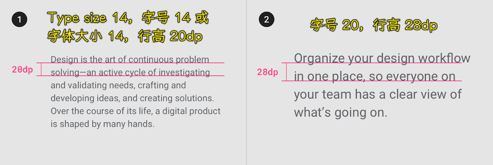

4. Paragraph spacing

段落间距应保持在字体大小的`0.75x`到`1.25x`之间

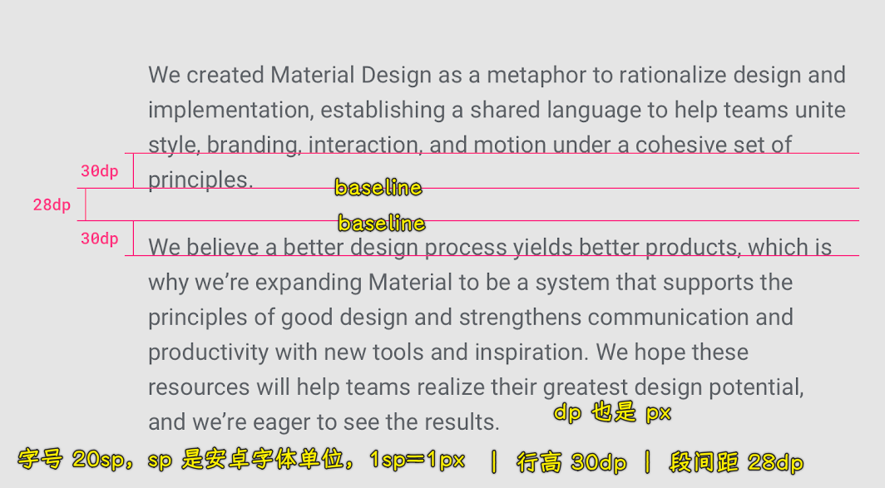

5. Type alignment

Type alignment 控制文本在显示空间中的对齐方式。有三种类型对齐：

* Left-aligned: when text is aligned to the left margin -> 英文的书写方式，从左到右，默认左对齐
* Right-aligned: when text is aligned to the right margin -> 阿拉伯语的书写方式，从右到左，默认右对齐
* Centered: when text is aligned to the center of the area it is set in -> 不推荐用于长文本，文字在中间显示

💡：Using system fonts

如：

- Chrome 浏览器最小字体为 `12px`
- 安卓手机最小字体是 8px,
- 苹果没有限制，想多小就多小
